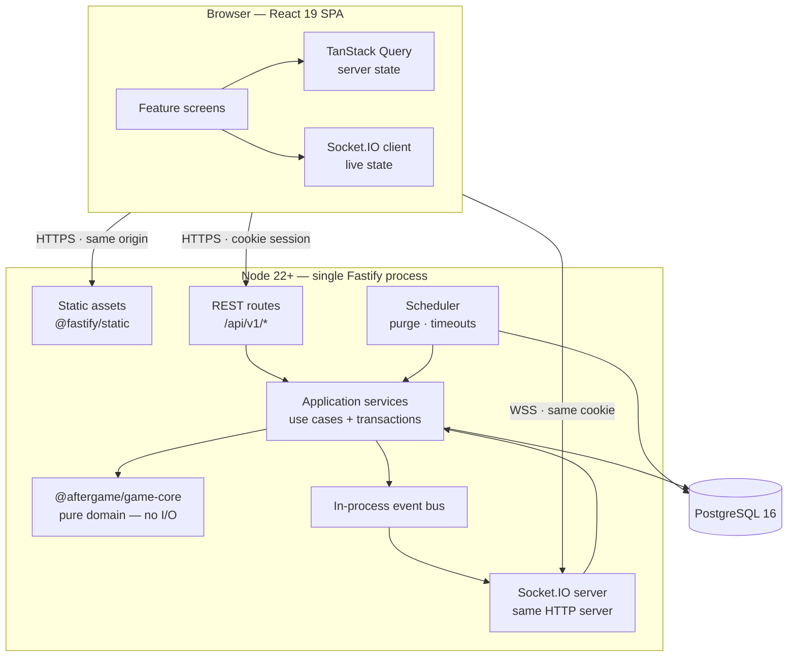
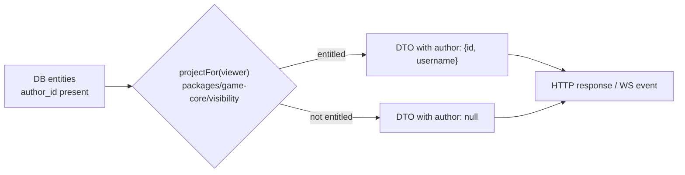
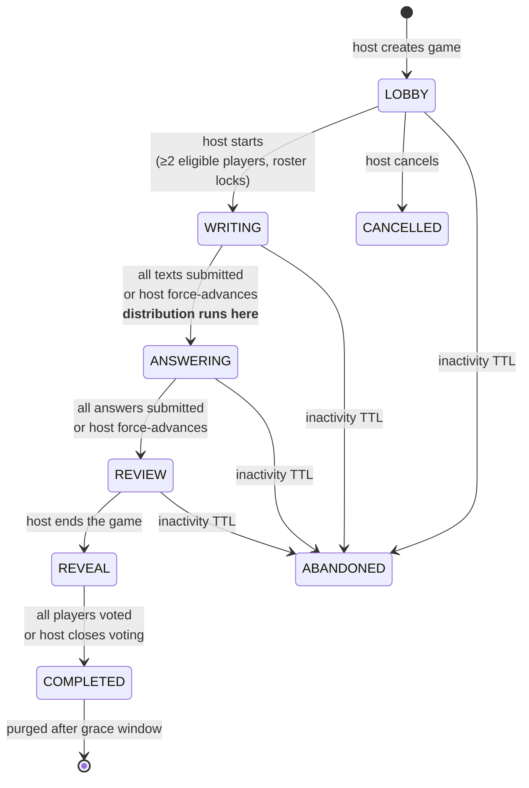
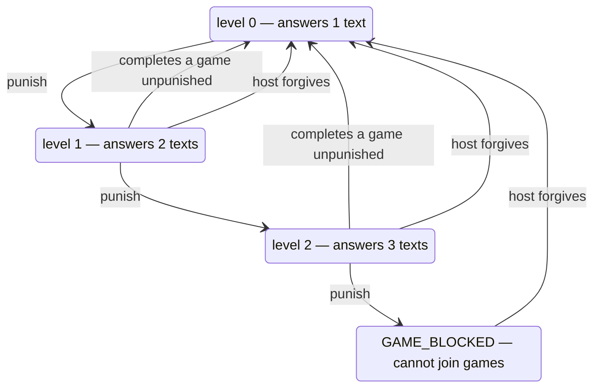

# 01 — Recommended architecture

## 1. The shape of the system

One deployable API process, one static bundle, one database. That is the whole system.



**Single origin, deliberately.** In production, Fastify serves both the API under `/api` and the
built SPA from `/`. This is not laziness — it removes CORS entirely, lets the session cookie use
the `__Host-` prefix with `SameSite=Lax` (the strongest practical CSRF posture), keeps WebSocket
upgrades on the same host, and collapses deployment to one unit that fits every free hosting
tier. In development, Vite's dev server proxies `/api` and `/socket.io` to Fastify, so the code
sees the same origin in both environments.

## 2. Layering inside the API

Four layers, one direction of dependency. Nothing below reaches upward.

| Layer           | Location                                               | Responsibility                                                                              | May import          |
| --------------- | ------------------------------------------------------ | ------------------------------------------------------------------------------------------- | ------------------- |
| **Transport**   | `apps/api/src/modules/*/`*`.routes.ts`, `*.gateway.ts` | HTTP/WS shape, Zod parsing, status codes. No business logic.                                | Application         |
| **Application** | `*.service.ts`                                         | Use cases, transactions, authorization calls, event emission                                | Domain, Persistence |
| **Domain**      | `packages/game-core`                                   | Rules: distribution, punishment, phases, visibility. **Pure functions, zero dependencies.** | nothing             |
| **Persistence** | `*.repository.ts`                                      | Prisma queries. Returns entities, never DTOs.                                               | Prisma client       |

The rule that makes this worth doing: **`game-core` has no imports.** Not Prisma, not Fastify,
not `node:crypto`. It takes plain data in and returns plain data out. Every interesting rule in
this product — how texts are shuffled, when a punishment resets, who may see a name — is a pure
function that can be tested ten thousand times a second with generated inputs and no database.
That single decision is what makes "tested" achievable rather than aspirational.

Randomness and time are injected into `game-core` (a seeded PRNG and a `now` value), so the same
inputs always produce the same distribution. The seed is stored on the session row, which means
any distribution can be replayed for debugging without retaining game content.

## 3. The anonymity boundary

Anonymity is the product. If author identity leaks once, the game is over — so we treat it as a
security boundary with a single enforcement point, not as a UI concern.

**Rule: the API never sends an identifier the viewer is not entitled to see.** Not hidden by CSS,
not present-but-unused in a JSON payload, not inferable from ordering or timing.



Concretely:

1. **One projection module.** Every game payload — REST response _and_ WebSocket event — passes
   through `projectTimeline(viewer, session, entities)` in `game-core`. There is no second path.
   A DTO type that structurally cannot hold an `authorId` outside the reveal phase is enforced by
   TypeScript, and asserted at runtime in tests.
2. **Order is shuffled.** Texts and answers are displayed in an order derived from the session's
   display seed, never in submission order — otherwise "first text submitted" identifies the
   quickest typist.
3. **Timing is aggregated.** The server broadcasts `progress: { submitted: 6, required: 8 }`,
   never "Sarah submitted". This is exactly the progress display the brief asks for, and it is
   also the privacy-preserving one.
4. **Assignments are never disclosed.** Who received which text is not exposed to anyone,
   including the host, at any phase. Combined with knowing your own assignment, a leaked map
   would narrow authorship by elimination.
5. **Reveal votes are write-only.** `reveal_votes` rows are readable by exactly one query in the
   codebase (the entitlement check). A test greps the compiled DTO builders and fails the build
   if `revealVote` or `choice` appears in any serialized shape.
6. **Logs are content-free.** Pino redaction drops `body`, `text`, `answer`, `comment`,
   `password` at the serializer level. We log ids and phases, never what anyone wrote.

## 4. Session lifecycle

The whole game is one explicit state machine, implemented as a transition table in `game-core`.
Illegal transitions are impossible to express, not merely rejected.



| Phase       | Players can                                                                                                                                                                           | Host can additionally                           |
| ----------- | ------------------------------------------------------------------------------------------------------------------------------------------------------------------------------------- | ----------------------------------------------- |
| `LOBBY`     | join, leave                                                                                                                                                                           | punish, forgive, configure theme, start, cancel |
| `WRITING`   | draft + submit one text, edit before submit                                                                                                                                           | force-advance                                   |
| `ANSWERING` | draft + submit answers to their assignments                                                                                                                                           | force-advance                                   |
| `REVIEW`    | read timeline, comment live, guess authors _(Anecdotes)_                                                                                                                              | end game                                        |
| `REVEAL`    | cast a private YES/NO reveal vote                                                                                                                                                     | close voting                                    |
| `COMPLETED` | read final timeline — authors shown to **everyone** if every participant voted YES, to **nobody** otherwise ([D8](00-spec-decisions.md#d8-reveal-is-collective--unanimous-or-nobody)) | —                                               |

**Distribution is the critical section.** It runs exactly once, inside a `SERIALIZABLE`
transaction that re-reads the session row `FOR UPDATE` and asserts `status = 'WRITING'` before
writing assignments. Concurrent "all players submitted" triggers therefore collapse into one
winner; the losers see the session already in `ANSWERING` and no-op. The session also carries a
`version` column for optimistic concurrency on host actions.

## 5. Random distribution — the core algorithm

Given `N` participants, `N` submitted texts, and per-player demand
`d(p) = min(1 + punishmentLevel(p), N)` (see [D3](00-spec-decisions.md#d3-demand-must-be-clamped-to-the-number-of-texts)),
produce assignments `A ⊆ Texts × Players` satisfying:

|        | Invariant                                                                            |
| ------ | ------------------------------------------------------------------------------------ |
| **I1** | every player receives exactly `d(p)` texts                                           |
| **I2** | no player receives the same text twice — equivalently, never two texts by one author |
| **I3** | every text is assigned at least once (no orphaned text)                              |
| **I4** | text usage is balanced: each text used `⌊S/N⌋` or `⌈S/N⌉` times, where `S = Σd(p)`   |
| **I5** | _(soft)_ self-assignment is minimised, never forbidden                               |

**Algorithm — degree-constrained bipartite b-matching by augmenting paths:**

1. Compute `S = Σ d(p)`. Give every text a capacity of `⌊S/N⌋`; distribute the remaining
   `S mod N` extra capacity to randomly chosen texts. _(Guarantees I3 and I4 by construction,
   since `S ≥ N`.)_
2. Treat "receiving your own text" as a **forbidden edge**, and satisfy each player's demand one
   unit at a time, hardest first. Giving a player one more text either finds a text with spare
   capacity, or finds a full text whose current holder can be relocated — recursively. A visited
   set bounds the search, which therefore succeeds whenever an assignment exists.
3. If no self-free arrangement is found, reshuffle which texts hold the spare capacity and retry
   a bounded number of times; failing that, drop the forbidden edge. Without it the problem is
   always solvable, because `d(p) ≤ N` (Gale–Ryser).

> **This replaced a simpler design, and the reason is worth keeping.** The original plan was the
> descending-demand greedy from the Gale–Ryser proof, followed by a 2-opt repair pass to trade
> away self-assignments. That greedy is genuinely sufficient for I1–I4 and never gets stuck. It
> is **not** sufficient for I5, and the property tests proved it during Phase 5: with four texts
> and demands 3, 3, 3, 1 a self-free arrangement exists, but the greedy reaches a state no single
> swap can repair — and deeper bounded repair only moves the counterexample further out.
> Modelling self-assignment as a forbidden edge makes I5 exact rather than best-effort.
> Complexity is `O(S · N²)`; at `N ≤ 30` still comfortably under a millisecond.

Determinism comes from the stored seed: the same seed always produces byte-identical assignments,
so a distribution can be replayed from eight bytes long after the game itself has been deleted.

Property tests (`fast-check`) generate random `N ∈ [2, 40]` with random punishment levels and
assert I1–I5 across **10,000 games**. The database independently enforces I2 with a unique index
on `(text_id, receiver_player_id)` — belt and braces, because a bug here silently ruins a game
rather than throwing.

## 6. Punishment state machine

Per `(group, user)`, not per user — the counter is group-scoped by construction.



Every edge writes a `punishment_events` audit row carrying actor, target, action and resulting
level. The counter is therefore reconstructible from the log, and survives game purges.

## 7. Real-time design

Socket.IO on the same HTTP server as the REST API.

- **Authentication:** the WebSocket handshake carries the same `__Host-session` cookie. The
  server verifies it in the connection middleware and attaches the user; unauthenticated sockets
  are rejected at handshake, not later.
- **Rooms:** `group:{groupId}` for lobby/presence, `session:{sessionId}` for game state. Joining
  a room is authorized against membership and roster on every join, never trusted from the
  client.
- **Projection before emit:** every payload leaving the server passes through the same
  `projectFor(viewer)` function used by REST — the socket is not a second, laxer path. Because
  reveal is collective ([D8](00-spec-decisions.md#d8-reveal-is-collective--unanimous-or-nobody)),
  author entitlement is uniform across a session, so timeline payloads can be **broadcast** to the
  session room. Payloads carrying viewer-specific data — your assignments, your draft, your own
  guess — are still emitted **per socket**. The projection keeps its `viewer` parameter regardless,
  so a return to per-person entitlement would be a rule change rather than a refactor.
- **Write path:** clients never mutate through the socket. All writes are REST (`POST /comments`
  etc.); the service commits, publishes to the in-process event bus, and the gateway fans out.
  One code path, one authorization pass, one transaction boundary — the socket is purely a
  delivery mechanism. This is the single most valuable simplification in the real-time design.
- **Reconnect:** on connect the client calls `GET /sessions/:id/state` for a full snapshot, then
  applies deltas. Free-tier hosts that sleep idle instances will drop sockets; this makes that a
  non-event.
- **Scale-out:** the default in-memory adapter is correct for one process, which is what the free
  deployment runs. `@socket.io/postgres-adapter` (no extra service — reuses PostgreSQL
  `LISTEN/NOTIFY`) is the documented upgrade path for multi-instance, and the event bus is already
  the seam where it plugs in.

Events emitted: `session.phase_changed`, `session.progress`, `session.player_joined|left`,
`session.roster_locked`, `timeline.comment_added`, `session.reveal_progress`,
`session.reveal_ready`, `group.member_changed`, `group.punishment_changed`.

## 8. Error handling

A typed `AppError` hierarchy in `packages/shared`, serialized as RFC 9457 `application/problem+json`:

```jsonc
{
  "type": "https://aftergame.app/errors/session-phase-invalid",
  "title": "Action not allowed in this phase",
  "status": 409,
  "code": "SESSION_PHASE_INVALID", // stable enum, shared with the client
  "detail": "The game has already moved to answering.",
  "instance": "req_01HX…",
}
```

The `code` enum is shared TypeScript, so the client maps errors to human copy (and, later,
translations) without string-matching English. Unexpected exceptions are caught by one Fastify
error handler, logged with a request id, and returned as a generic 500 with that id — internal
messages never reach the client.

## 9. Background jobs

A small in-process scheduler (`node-cron`) — no queue infrastructure, because there is no
workload that justifies one:

| Job                    | Cadence      | Purpose                                                                                                                                    |
| ---------------------- | ------------ | ------------------------------------------------------------------------------------------------------------------------------------------ |
| `purgeExpiredSessions` | every 10 min | hard-delete sessions past their grace window ([D11](00-spec-decisions.md#d11-do-not-permanently-store-completed-games--defined-precisely)) |
| `abandonStaleSessions` | every 10 min | move sessions with no activity past TTL to `ABANDONED`                                                                                     |
| `pruneAuthSessions`    | hourly       | delete expired auth sessions                                                                                                               |
| `expireInvitations`    | hourly       | mark expired invite codes unusable                                                                                                         |

Jobs take a PostgreSQL advisory lock before running, so running two API instances never
double-executes them.

## 10. Observability

`pino` structured logs with request ids and content redaction, `GET /healthz` (process alive)
and `GET /readyz` (database reachable, migrations applied) for host health checks, and Prisma
query timing at debug level. No third-party APM — it would be a paid dependency and the brief
forbids those.

## 11. What we deliberately did _not_ build

- **No microservices.** One API process. The domain is small and entirely transactional; splitting
  it would add network failure modes and buy nothing.
- **No Redis, no queue.** In-process event bus + advisory locks cover the needs at this scale, and
  every added service is another thing that must be free and self-hostable. The seams for both
  exist if load ever demands them.
- **No CQRS/event sourcing.** The data is deliberately short-lived; an event log would contradict
  the retention requirement.
- **No GraphQL.** The client's needs are a fixed, small set of screens; REST + Zod contracts +
  TanStack Query is less machinery for the same result.
