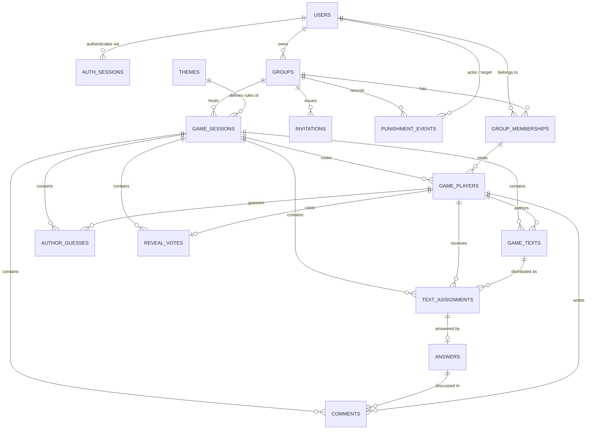

# 03 — Database schema

PostgreSQL 16, modelled in Prisma. Presented here as tables and relationships; the
`schema.prisma` file itself is a Phase 0 deliverable.

The schema is split into two zones with different lifetimes:

- **Durable zone** — users, groups, memberships, invitations, punishment audit. Lives forever.
- **Transient zone** — everything under a game session. Hard-deleted after the grace window
  ([D11](00-spec-decisions.md#d11-do-not-permanently-store-completed-games--defined-precisely)).

Every foreign key crossing from transient into durable is `ON DELETE RESTRICT` or `SET NULL`;
every foreign key _within_ the transient zone is `ON DELETE CASCADE`, so purging a finished game
is a single `DELETE FROM game_sessions WHERE id = $1`.

---

## Entity–relationship diagram



---

## Durable zone

### `users`

| Column                      | Type          | Notes                                           |
| --------------------------- | ------------- | ----------------------------------------------- |
| `id`                        | `uuid` PK     | `gen_random_uuid()`                             |
| `username`                  | `citext`      | 3–32 chars, unique, `^[a-zA-Z0-9_.-]+$`         |
| `email`                     | `citext`      | unique — `citext` makes `A@x.com` = `a@x.com`   |
| `password_hash`             | `text`        | argon2id encoded string, includes salt & params |
| `created_at` / `updated_at` | `timestamptz` |                                                 |

No public profile, per the brief. `username` is the only identifier ever shown to other users,
and only inside groups they share.

### `auth_sessions`

| Column                       | Type              | Notes                                                                  |
| ---------------------------- | ----------------- | ---------------------------------------------------------------------- |
| `id`                         | `uuid` PK         |                                                                        |
| `user_id`                    | `uuid` FK → users | `ON DELETE CASCADE`                                                    |
| `token_hash`                 | `bytea` unique    | SHA-256 of the opaque cookie token — **the raw token is never stored** |
| `expires_at`                 | `timestamptz`     | sliding, refreshed on use                                              |
| `created_at`, `last_used_at` | `timestamptz`     |                                                                        |
| `user_agent`, `ip_hash`      | `text`            | truncated UA and hashed IP, for "sign out other devices"               |

Indexes: `token_hash` (unique), `expires_at` (purge job), `user_id`.

### `groups`

| Column                      | Type              | Notes                                          |
| --------------------------- | ----------------- | ---------------------------------------------- |
| `id`                        | `uuid` PK         |                                                |
| `name`                      | `varchar(60)`     | 2–60 chars                                     |
| `owner_id`                  | `uuid` FK → users | `ON DELETE RESTRICT` — the owner cannot vanish |
| `created_at` / `updated_at` | `timestamptz`     |                                                |

Groups are private with no discovery surface: there is no listing endpoint, no search, and no
public read. The only route in is a valid invitation code.

### `group_memberships`

The heart of the authorization model, and the home of the punishment counter.

| Column                    | Type               | Notes                           |
| ------------------------- | ------------------ | ------------------------------- |
| `id`                      | `uuid` PK          |                                 |
| `group_id`                | `uuid` FK → groups | `ON DELETE CASCADE`             |
| `user_id`                 | `uuid` FK → users  | `ON DELETE CASCADE`             |
| `role`                    | `enum`             | `OWNER` \| `COHOST` \| `MEMBER` |
| `status`                  | `enum`             | `ACTIVE` \| `GAME_BLOCKED`      |
| `consecutive_punishments` | `smallint`         | default `0`, `CHECK (0..3)`     |
| `joined_at`               | `timestamptz`      |                                 |

- Unique `(group_id, user_id)` — one membership per person per group.
- Partial unique index on `(group_id) WHERE role = 'OWNER'` — exactly one owner, enforced by the
  database rather than by hope.
- `status = 'GAME_BLOCKED'` ⟺ `consecutive_punishments = 3`, kept consistent inside one
  transaction.
- Index `(user_id)` for "my groups".

**Why the counter lives here:** it is scoped to `(group, user)` by primary key, which is exactly
the brief's requirement that Group A's punishments are invisible to Group B. There is no way to
express it wrongly.

### `invitations`

| Column          | Type                 | Notes                                               |
| --------------- | -------------------- | --------------------------------------------------- |
| `id`            | `uuid` PK            |                                                     |
| `group_id`      | `uuid` FK → groups   | `ON DELETE CASCADE`                                 |
| `code`          | `varchar(10)` unique | 8 chars, Crockford base32 from `crypto.randomBytes` |
| `created_by_id` | `uuid` FK → users    | `ON DELETE SET NULL`                                |
| `expires_at`    | `timestamptz?`       | null = no expiry                                    |
| `max_uses`      | `int?`               | null = unlimited                                    |
| `use_count`     | `int`                | default 0                                           |
| `revoked_at`    | `timestamptz?`       |                                                     |
| `created_at`    | `timestamptz`        |                                                     |

Crockford base32 excludes `I`, `L`, `O` and `U`, so codes are unambiguous when read aloud at a
party — which is how they will actually be shared. 8 characters is ~40 bits; combined with
redemption rate limiting, enumeration is not viable. A group's "room code" is simply its current
active invitation, created on demand; a host can revoke and regenerate at any time.

### `punishment_events`

An append-only audit log. Survives game purges.

| Column            | Type               | Notes                                                  |
| ----------------- | ------------------ | ------------------------------------------------------ |
| `id`              | `uuid` PK          |                                                        |
| `group_id`        | `uuid` FK → groups | `ON DELETE CASCADE`                                    |
| `target_user_id`  | `uuid` FK → users  | `ON DELETE CASCADE`                                    |
| `actor_user_id`   | `uuid?` FK → users | `ON DELETE SET NULL`                                   |
| `action`          | `enum`             | `PUNISH` \| `FORGIVE` \| `AUTO_RESET`                  |
| `resulting_level` | `smallint`         | counter value after the action                         |
| `game_session_id` | `uuid?`            | **`ON DELETE SET NULL`** — outlives the purged session |
| `reason`          | `varchar(200)?`    | optional host note                                     |
| `created_at`      | `timestamptz`      |                                                        |

This table is why "consecutive punishments" is defensible. It reconstructs the counter, shows a
group its own history, and makes host abuse visible. It contains no game content, so retaining it
does not violate [D11](00-spec-decisions.md#d11-do-not-permanently-store-completed-games--defined-precisely).

### `themes`

| Column                  | Type                 | Notes                                                 |
| ----------------------- | -------------------- | ----------------------------------------------------- |
| `id`                    | `uuid` PK            |                                                       |
| `slug`                  | `varchar(40)` unique | `questions` \| `challenges` \| `anecdotes`            |
| `name`, `description`   | `text`               | shown in the theme picker                             |
| `write_prompt`          | `text`               | e.g. "Write a question for someone else to answer"    |
| `write_placeholder`     | `text`               | e.g. "What is the craziest thing you have ever done?" |
| `answer_prompt`         | `text`               | e.g. "Answer honestly — nobody knows it's you"        |
| `icon`                  | `varchar(40)`        | lucide icon name                                      |
| `supports_comments`     | `boolean`            |                                                       |
| `supports_author_guess` | `boolean`            |                                                       |
| `is_system`             | `boolean`            | seeded defaults cannot be deleted                     |
| `sort_order`            | `int`                |                                                       |

Seeded idempotently by slug. Capability flags drive behaviour
([D15](00-spec-decisions.md#d15-themes-are-data-not-if-statements)): Anecdotes ships with both
flags true, Questions and Challenges with both false. Comments and guessing are gated on the
theme row, not on a hardcoded branch — which is what makes a fourth theme a seed row instead of
an engineering task.

---

## Transient zone

### `game_sessions`

| Column                                                     | Type               | Notes                                                                               |
| ---------------------------------------------------------- | ------------------ | ----------------------------------------------------------------------------------- |
| `id`                                                       | `uuid` PK          |                                                                                     |
| `group_id`                                                 | `uuid` FK → groups | `ON DELETE CASCADE`                                                                 |
| `theme_id`                                                 | `uuid` FK → themes | `ON DELETE RESTRICT`                                                                |
| `created_by_id`                                            | `uuid?` FK → users | `ON DELETE SET NULL`                                                                |
| `status`                                                   | `enum`             | `LOBBY`·`WRITING`·`ANSWERING`·`REVIEW`·`REVEAL`·`COMPLETED`·`CANCELLED`·`ABANDONED` |
| `required_text_count`                                      | `int`              | = participant count at roster lock                                                  |
| `distribution_seed`                                        | `bigint`           | PRNG seed — makes distribution reproducible                                         |
| `display_seed`                                             | `bigint`           | shuffles timeline order so it never mirrors submission order                        |
| `reveal_scope`                                             | `enum`             | `TEXTS` \| `TEXTS_AND_ANSWERS` (default)                                            |
| `settings`                                                 | `jsonb`            | forward-compatible knobs (timers, char limits)                                      |
| `version`                                                  | `int`              | optimistic concurrency on host actions                                              |
| `created_at`, `started_at`, `ended_at`, `last_activity_at` | `timestamptz`      |                                                                                     |
| `purge_after`                                              | `timestamptz?`     | set when entering `COMPLETED`; the purge job's index                                |

Indexes:

- **`UNIQUE (group_id) WHERE status NOT IN ('COMPLETED','CANCELLED','ABANDONED')`** — the
  partial unique index enforcing [D12](00-spec-decisions.md#d12-one-live-session-per-group-at-a-time), one live game per group, at the database level.
- `(purge_after)` for the purge job; `(last_activity_at)` for the abandon job.

### `game_players`

The session roster, locked at start. One row per participant.

| Column                      | Type                          | Notes                                                                                                                    |
| --------------------------- | ----------------------------- | ------------------------------------------------------------------------------------------------------------------------ |
| `id`                        | `uuid` PK                     | the identifier used in _all_ game payloads — never `user_id`                                                             |
| `session_id`                | `uuid` FK → game_sessions     | `ON DELETE CASCADE`                                                                                                      |
| `user_id`                   | `uuid` FK → users             | `ON DELETE CASCADE`                                                                                                      |
| `membership_id`             | `uuid` FK → group_memberships | `ON DELETE CASCADE`                                                                                                      |
| `punishment_level_at_start` | `smallint`                    | snapshot, 0–2                                                                                                            |
| `was_punished_this_session` | `boolean`                     | drives the reset rule, [D5](00-spec-decisions.md#d5-punishment-counter-resets-only-for-a-game-played-without-punishment) |
| `receive_quota`             | `int`                         | the clamped demand `d(p)`, snapshotted at distribution                                                                   |
| `text_submitted`            | `boolean`                     | denormalised for the progress counter                                                                                    |
| `joined_at`, `left_at`      | `timestamptz`                 |                                                                                                                          |

Unique `(session_id, user_id)`.

**Design note — the indirection is a privacy feature.** Every in-game entity references a
`game_player.id`, never a `user_id`. `game_players` is the _only_ table that maps a session
identity back to a real account, and it is queried in exactly one place: the entitlement check.
Purging a session destroys that mapping table along with the content.

### `game_texts`

| Column                       | Type                     | Notes                                                                            |
| ---------------------------- | ------------------------ | -------------------------------------------------------------------------------- |
| `id`                         | `uuid` PK                |                                                                                  |
| `session_id`                 | `uuid` FK                | `ON DELETE CASCADE`                                                              |
| `author_player_id`           | `uuid` FK → game_players | `ON DELETE CASCADE`                                                              |
| `body`                       | `varchar(1000)`          | `CHECK (length(btrim(body)) > 0)` — empty texts are rejected by the database too |
| `status`                     | `enum`                   | `DRAFT` \| `SUBMITTED`                                                           |
| `display_order`              | `int`                    | derived from `display_seed`, not from insertion order                            |
| `created_at`, `submitted_at` | `timestamptz`            |                                                                                  |

Unique `(session_id, author_player_id)` — exactly one text per author
([D1](00-spec-decisions.md#d1-punishment-adds-received-texts-not-authored-texts)).

### `text_assignments`

The many-to-many join that makes punishment loads possible.

| Column               | Type                     | Notes                                |
| -------------------- | ------------------------ | ------------------------------------ |
| `id`                 | `uuid` PK                |                                      |
| `session_id`         | `uuid` FK                | `ON DELETE CASCADE`                  |
| `text_id`            | `uuid` FK → game_texts   | `ON DELETE CASCADE`                  |
| `receiver_player_id` | `uuid` FK → game_players | `ON DELETE CASCADE`                  |
| `status`             | `enum`                   | `PENDING` \| `ANSWERED` \| `SKIPPED` |
| `created_at`         | `timestamptz`            |                                      |

**`UNIQUE (text_id, receiver_player_id)`** — this single constraint is the database-level
enforcement of the brief's "never two texts by the same author to one receiver" rule
([D2](00-spec-decisions.md#d2-never-two-texts-by-the-same-author-reduces-to-never-the-same-text-twice)).
A bug in the distribution algorithm cannot corrupt a game; the transaction aborts instead.

Index `(receiver_player_id)` — the hottest query in the app ("what do I have to answer?").

### `answers`

| Column                       | Type             | Notes                                             |
| ---------------------------- | ---------------- | ------------------------------------------------- |
| `id`                         | `uuid` PK        |                                                   |
| `assignment_id`              | `uuid` FK unique | 1:1 with the assignment, `ON DELETE CASCADE`      |
| `session_id`                 | `uuid` FK        | denormalised for purge and session-scoped queries |
| `body`                       | `varchar(1000)`  | `CHECK (length(btrim(body)) > 0)`                 |
| `status`                     | `enum`           | `DRAFT` \| `SUBMITTED`                            |
| `created_at`, `submitted_at` | `timestamptz`    |                                                   |

The author of an answer is `assignment.receiver_player_id` — not duplicated, so it cannot drift.

### `comments`

| Column             | Type                     | Notes                           |
| ------------------ | ------------------------ | ------------------------------- |
| `id`               | `uuid` PK                |                                 |
| `session_id`       | `uuid` FK                | `ON DELETE CASCADE`             |
| `answer_id`        | `uuid` FK → answers      | `ON DELETE CASCADE`             |
| `author_player_id` | `uuid` FK → game_players | `ON DELETE CASCADE`             |
| `body`             | `varchar(500)`           | `CHECK` non-empty               |
| `is_anonymous`     | `boolean`                | chosen per comment at post time |
| `created_at`       | `timestamptz`            |                                 |

Index `(answer_id, created_at)`. Anonymous comments never expose `author_player_id` — in any
phase, to anyone, including after the reveal
([D17](00-spec-decisions.md#d17-comments-are-anonymous-or-named-per-comment)).

### `author_guesses`

| Column              | Type                     | Notes               |
| ------------------- | ------------------------ | ------------------- |
| `id`                | `uuid` PK                |                     |
| `session_id`        | `uuid` FK                | `ON DELETE CASCADE` |
| `text_id`           | `uuid` FK → game_texts   | `ON DELETE CASCADE` |
| `guesser_player_id` | `uuid` FK → game_players | `ON DELETE CASCADE` |
| `guessed_player_id` | `uuid` FK → game_players | `ON DELETE CASCADE` |
| `created_at`        | `timestamptz`            |                     |

Unique `(text_id, guesser_player_id)` — one guess per person per text, changeable until the
`REVIEW` phase closes. Correctness is computed on read and disclosed only to entitled viewers
([D9](00-spec-decisions.md#d9-author-guesses-are-gated-behind-the-same-reveal-wall)).

### `reveal_votes`

The most access-restricted table in the system.

| Column       | Type                            | Notes               |
| ------------ | ------------------------------- | ------------------- |
| `id`         | `uuid` PK                       |                     |
| `session_id` | `uuid` FK                       | `ON DELETE CASCADE` |
| `player_id`  | `uuid` FK unique → game_players | `ON DELETE CASCADE` |
| `choice`     | `enum`                          | `YES` \| `NO`       |
| `created_at` | `timestamptz`                   |                     |

Unique `(session_id, player_id)`.

**Access rules, enforced by convention _and_ by tests:**

- Read by exactly one repository method, `getSessionEntitlement(sessionId)`, which answers a
  single question — _did every participant vote YES?_ — and returns a boolean, never rows.
  Reveal is collective ([D8](00-spec-decisions.md#d8-reveal-is-collective--unanimous-or-nobody)),
  so the answer is the same for every viewer; abstention counts as NO, and players who left before
  `REVEAL` are excluded from the denominator.
- The count of _decided_ voters is exposed for the progress indicator. **The yes/no split is
  never computed, never returned, never logged** — publishing it would deanonymise the vote in a
  small group ([D8a](00-spec-decisions.md#d8a-reveal-votes-stay-private-and-the-tally-is-never-published)).
- A custom lint rule fails the build if `choice` appears in any DTO builder.

---

## Relationships, in words

- A **user** owns zero or more **groups** and holds one **membership** per group they belong to.
  The membership — not the user — carries the role and the punishment counter, which is exactly
  why punishments are group-local.
- A **group** issues **invitations**; redeeming a valid code creates a membership. There is no
  other way in.
- A **group** hosts at most one live **game session**, which names exactly one **theme**.
- A session locks a roster of **game players**. Each player authors exactly one **game text**.
- Distribution creates **text assignments** — many-to-many, because punished players receive more
  texts than exist authors-per-player. Each assignment gets at most one **answer**.
- An answer collects **comments** (Anecdotes) and each text collects **author guesses**.
- Each player casts one private **reveal vote**. The votes are combined into a single collective
  outcome: authors are revealed to the whole group only if every participant voted YES.

---

## Retention & purge

```
DELETE FROM game_sessions WHERE id = $1
   └─ CASCADE game_players
   └─ CASCADE game_texts ─ CASCADE text_assignments ─ CASCADE answers ─ CASCADE comments
   └─ CASCADE author_guesses
   └─ CASCADE reveal_votes
   └─ SET NULL punishment_events.game_session_id        ← audit survives
```

One statement removes every trace of the game's content and every mapping from anonymous
identity back to a user. Before the delete runs, the completion handler has already written the
only two things that must persist: the punishment counter update
([D5](00-spec-decisions.md#d5-punishment-counter-resets-only-for-a-game-played-without-punishment))
and its audit row.

Default grace window: **24 hours** after `COMPLETED`, configurable via `SESSION_GRACE_HOURS`.

---

## Global conventions

- **UUIDv7** primary keys (time-ordered, so they index like sequential ids without leaking counts).
- `timestamptz` everywhere; the server works exclusively in UTC and the client formats locally.
- `citext` for `email` and `username` — the extension is enabled in the first migration.
- Every enum is a native PostgreSQL enum, mirrored as a TypeScript union in `packages/shared`.
- `CHECK` constraints for every business range (`consecutive_punishments` 0–3, non-empty bodies,
  length bounds). Validation lives in three places on purpose: Zod at the edge for good error
  messages, the domain for rules, and the database as the constraint that cannot be bypassed.
- Migrations are `prisma migrate` SQL files, reviewed in PRs, applied with `migrate deploy` in
  release. No schema drift, no `db push` outside local scratch work.
