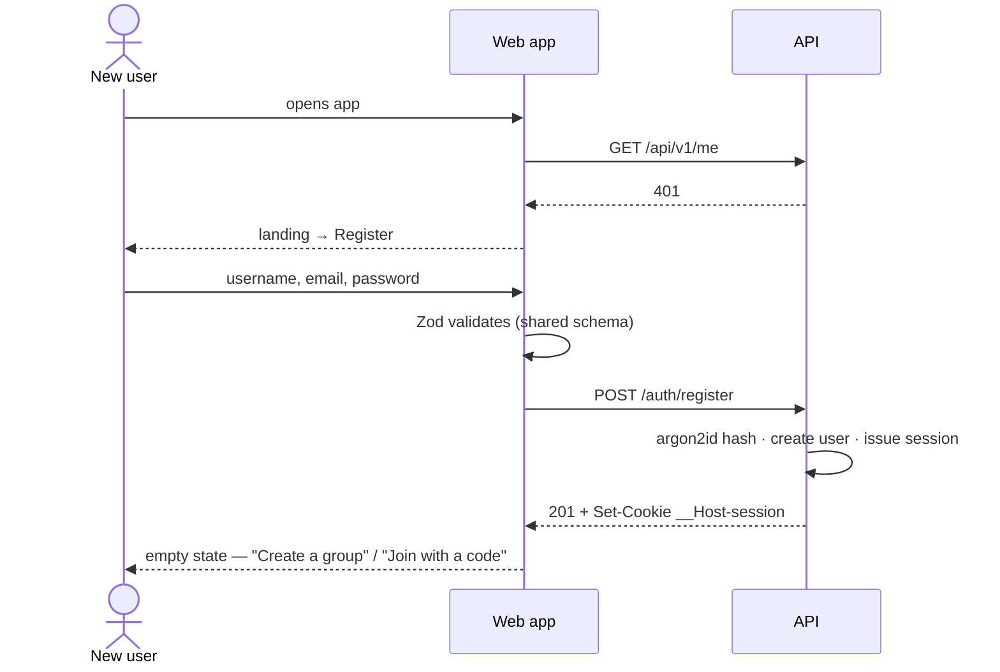
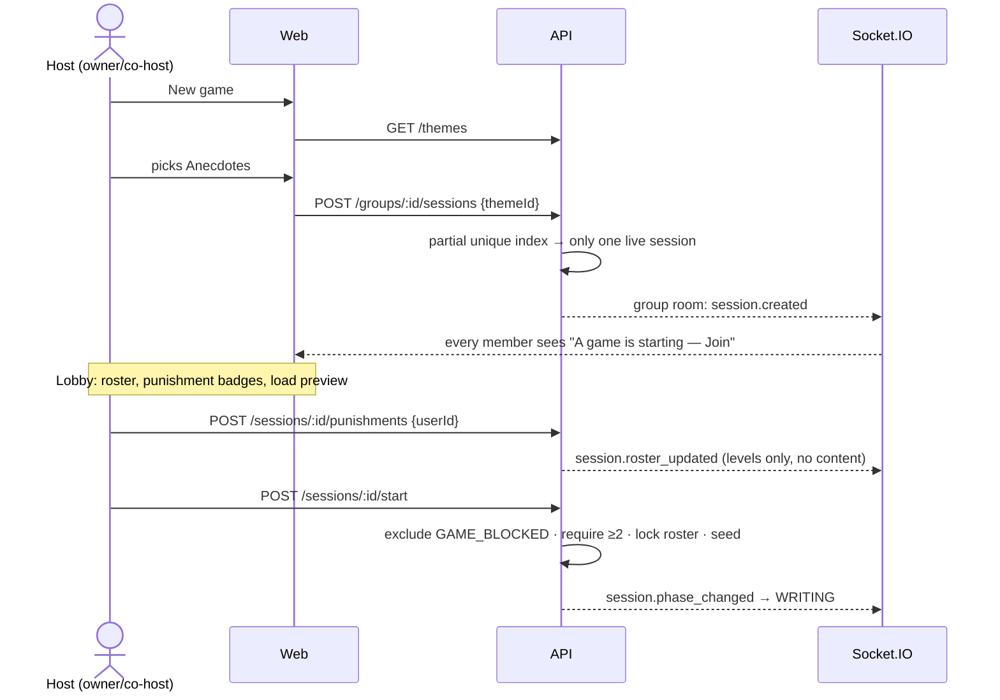
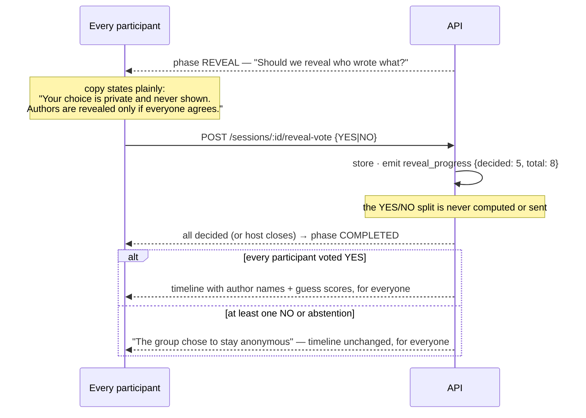
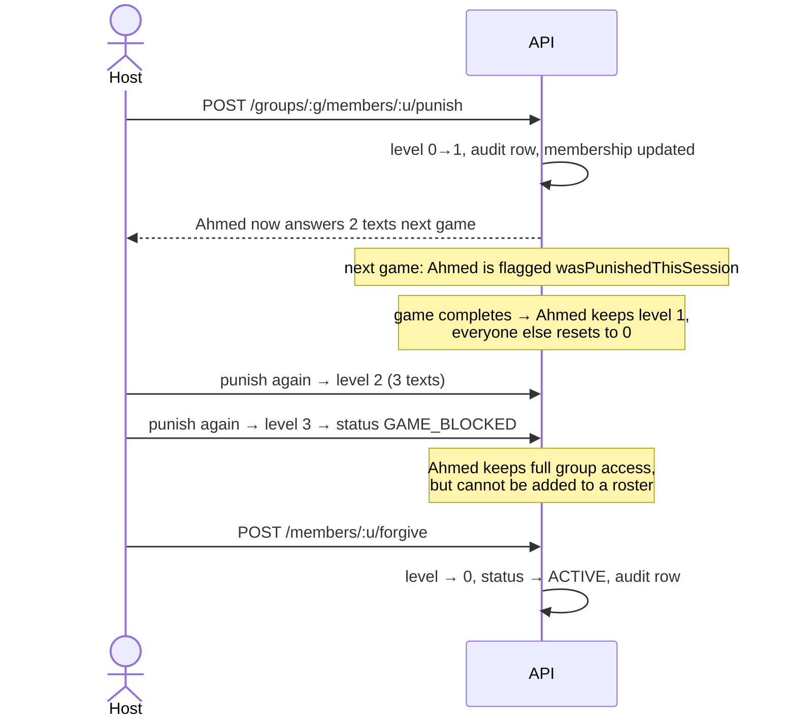

# 05 — User flows

Happy paths first, then the edge cases that decide whether this feels like a product or a demo.

---

## F1. First run — register → group → play



Registration signs the user in directly — a second login form after signup is friction with no
security benefit. Password rules: ≥10 characters, checked against a small common-password list,
with a strength meter that informs rather than blocks. Duplicate email returns the same generic
"could not create account" as other failures, so the endpoint is not a user-enumeration oracle.

## F2. Create a group and invite

1. **Create** → name only. The creator becomes `OWNER` with an `ACTIVE` membership.
2. The group page shows a **room code** (8 characters, Crockford base32) with a copy button and a
   "generate new code" action that revokes the previous one.
3. Friends enter the code on **Join a group** → membership created as `MEMBER`, redirected into
   the group, and the sidebar updates live for everyone already inside via
   `group.member_changed`.

Invalid, expired, revoked and exhausted codes all return one identical message. Joining a group
you already belong to is a no-op that lands you in the group.

## F3. Host opens a game



The lobby shows each player's punishment level and the resulting answer load ("Sarah answers 2"),
because that is a rule of the game and hiding it would be confusing rather than private —
punishment is public within the group by design.

## F4. Writing phase

The theme banner is pinned at the top for the whole game, as required. Each player writes exactly
one text.

- Drafts autosave (debounced 800 ms `PATCH`), so a dropped connection or closed tab loses nothing.
- The character counter turns amber at 900 and red at 1000; the input hard-stops at 1000.
- `spellcheck` is on; the mic button appears only where the Web Speech API exists and streams
  interim results into the textarea, which the user can then edit.
- **Submit on empty or whitespace-only input is blocked** with an inline warning
  ("Write something first — it can't be empty"), the submit button disabled, and focus returned to
  the textarea. Rejected server-side and by a database `CHECK` as well.
- Everyone sees `6 / 8 texts` update live. **No names appear** — the counter is the only signal,
  which is both what the brief asks for and what anonymity requires.
- After submitting, the player sees a waiting state listing what happens next, not who is late.

When the last text lands (or the host force-advances, [D14](00-spec-decisions.md#d14-the-host-can-always-force-the-game-forward)), the server runs distribution inside one
serializable transaction and broadcasts `phase_changed → ANSWERING`.

## F5. Answering phase

Each player gets a queue of assignment cards — one card if unpunished, two or three if punished.
Cards show the received text and a composer with the same rules as F4. Progress shows submitted
answers over total assignments.

The queue never reveals who wrote a text, and never reveals _how many_ cards anyone else has, so
load differences are not a channel for identifying a punished player's answers.

## F6. Timeline, comments and guessing

The host ends answering; everyone lands on the timeline.

```
Anecdotes                                      [theme banner, pinned]
─────────────────────────────────────────────────────────────────────
"Tell us about your funniest childhood memory."          ← anonymous text
   ↳ Anonymous player: "I once tried to..."              ← anonymous answer
   ↳ Anonymous player: "My cousin dared me to..."        ← second answer (punished load)
      💬  Anonymous — "That is hilarious."
      💬  Sarah — "I think I know who wrote this."
      [ Comment as: (•) Anonymous  ( ) Sarah ]           ← per-comment choice
      🎯 Who wrote this?  [ Sarah ][ Ahmed ][ Lina ]…    ← Anecdotes only
```

- Order is shuffled by `display_seed`, never submission order.
- Comments arrive live over WebSocket; the sender sees theirs optimistically.
- A text answered by two players shows both answers under it — a direct consequence of the
  punishment mechanic ([D1](00-spec-decisions.md#d1-punishment-adds-received-texts-not-authored-texts)) and one of the better moments in the game.
- Guessing is open only while `REVIEW` is active, one guess per text per player, changeable until
  the phase closes. **No correctness feedback is shown yet.**

## F7. Reveal



Reveal is **collective** ([D8](00-spec-decisions.md#d8-reveal-is-collective--unanimous-or-nobody)):
one NO protects the whole table, and abstention counts as NO. The outcome is announced as a single
group fact with no indication of how many refused, and guess results and the leaderboard appear
only when reveal succeeds
([D9](00-spec-decisions.md#d9-author-guesses-are-gated-behind-the-same-reveal-wall)).

In 2- and 3-player games the vote screen adds an honest warning before you choose: with so few
players, a failed reveal narrows down who refused — at two players it identifies them outright.
That inference follows from the rule itself and no implementation can remove it, so we say so
rather than imply a privacy we cannot deliver.

The timeline remains readable for the grace window, then vanishes — the UI says so explicitly
("This game disappears in 23 hours") so nobody is surprised.

## F8. Punishment lifecycle



A blocked player sees a clear banner in the group ("You can't join games until a host forgives
you") rather than silently missing the Join button. The group's punishment history is visible to
all members — accountability for hosts, not a secret list.

## F9. Edge cases

| Situation                                         | Behaviour                                                                                                                                                                                |
| ------------------------------------------------- | ---------------------------------------------------------------------------------------------------------------------------------------------------------------------------------------- |
| **Player disconnects mid-game**                   | Still a participant, still owes their text/answers. Drafts survive. On reconnect, `GET /sessions/:id/state` restores the exact phase and queue.                                          |
| **Player never returns**                          | Host force-advances ([D14](00-spec-decisions.md#d14-the-host-can-always-force-the-game-forward)). Missing texts leave the pool; unanswered assignments show "no answer" in the timeline. |
| **Nobody touches the game for the TTL**           | Job moves it to `ABANDONED`, purges it, and resets nothing (an abandoned game is not "a game played").                                                                                   |
| **Host leaves / disconnects**                     | Any co-host can act. With no co-host present, the game waits and the abandon TTL is the safety net.                                                                                      |
| **Ownership transferred mid-game**                | Permitted; the new owner immediately has host controls, the old owner becomes a co-host and keeps them.                                                                                  |
| **Member removed mid-game**                       | Removed from the group and from the live roster. Their text stays in the pool (removing it mid-distribution would break assignments); their unanswered assignments become `SKIPPED`.     |
| **Blocked player tries to join a game**           | Join button replaced by the explanation banner; the API rejects with `MEMBER_GAME_BLOCKED` regardless.                                                                                   |
| **Second game started while one is live**         | 409 `SESSION_ALREADY_ACTIVE` with a link to the live game — enforced by a partial unique index, so even a race cannot create two.                                                        |
| **Fewer than 2 eligible players at start**        | Start disabled with the reason shown; API rejects with `SESSION_TOO_FEW_PLAYERS`.                                                                                                        |
| **2-player game with a punished player**          | Load clamps to 2 ([D3](00-spec-decisions.md#d3-demand-must-be-clamped-to-the-number-of-texts)) and the lobby explains why ("needs more players for the full penalty").                   |
| **Owner tries to leave the group**                | Blocked until ownership is transferred; the dialog offers the transfer inline.                                                                                                           |
| **Duplicate submit / double-click**               | Idempotency key per submit; the second request returns the first result rather than a 409.                                                                                               |
| **Grace window elapses while someone is reading** | The next request returns 404 `SESSION_GONE`; the UI shows a friendly "this game has ended and been deleted" screen rather than an error.                                                 |
| **Firefox user opens the composer**               | No mic button (feature-detected). Spellcheck and typing work identically.                                                                                                                |

## F10. Responsive behaviour

| Breakpoint   | Layout                                                                                                                                                     |
| ------------ | ---------------------------------------------------------------------------------------------------------------------------------------------------------- |
| `< 640px`    | Single column. Group rail and sidebar become a drawer. Composer is full-screen with a sticky action bar above the keyboard. Timeline cards are full-bleed. |
| `640–1024px` | Two columns: sidebar collapsible, main panel fluid.                                                                                                        |
| `> 1024px`   | Full Slack-style three-region layout; timeline capped at a comfortable measure (~72ch) rather than stretching.                                             |

Touch targets are ≥44px, the theme banner stays pinned at every size, and the primary action is
always reachable with one thumb on mobile.
