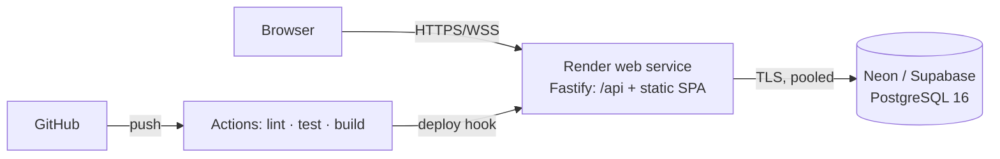
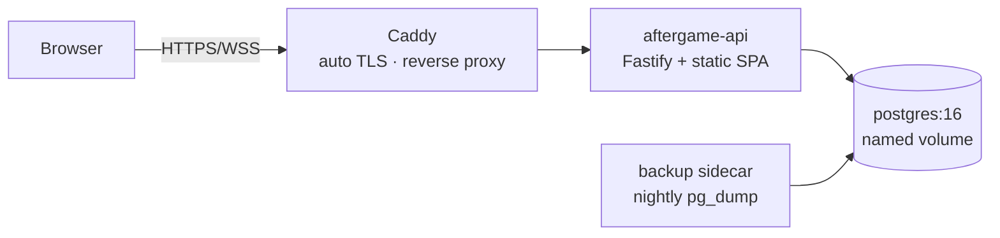

# 09 — Deployment

Two supported paths, both free. Free tiers change their terms regularly, so specific quotas are
deliberately not quoted here — verify current limits with each provider before committing.

---

## Local development

Prerequisites: Node 22+ and pnpm 9+. Docker is convenient for the development database but is
**not required** — the test suite starts its own PostgreSQL, and `DATABASE_URL` can point at any
PostgreSQL you already have.

```bash
git clone <repo> && cd aftergame
pnpm install
cp .env.example .env
docker compose up -d          # PostgreSQL 16 + Adminer on :8080
pnpm db:migrate               # prisma migrate dev
pnpm db:seed                  # the three themes, idempotent
pnpm dev                      # api :3000 · web :5173 (proxied to :3000)
```

Vite proxies `/api` and `/socket.io` to Fastify, so the browser sees **one origin** in
development exactly as it will in production — cookies, CSRF and WebSocket behaviour are
identical in both environments, which is the point.

```bash
pnpm test          # every suite, including the database integration tests
pnpm test:e2e      # Playwright
pnpm lint && pnpm typecheck
pnpm build         # both apps
pnpm verify        # everything CI runs, in order
```

**The database tests need no setup.** If `TEST_DATABASE_URL` is set they use that PostgreSQL
(`docker compose up -d` creates `aftergame_test` for exactly this); otherwise they start their
own PostgreSQL 16 on a temporary directory and delete it afterwards. Setting the variable is
worth it if you run the suite often — it skips the ~3s server boot.

Without Docker, point `DATABASE_URL` at any PostgreSQL you have access to and skip the
`docker compose` step; nothing else changes.

---

## Production build

One artifact, one process. `pnpm build` produces `apps/web/dist` (static) and
`apps/api/dist` (compiled server). In production Fastify serves the static bundle from `/` with
`@fastify/static` and the API under `/api`, with an SPA fallback to `index.html`.

A multi-stage Dockerfile builds both, then copies only the runtime output into a slim Node 22
image running as a non-root user with a read-only filesystem. Release command:

```
prisma migrate deploy && node dist/main.js
```

Migrations run as a separate, more privileged database role than the application itself.

---

## Path A — Managed free hosting (fastest to a public URL)

| Component             | Service                            | Notes                                                                                                                      |
| --------------------- | ---------------------------------- | -------------------------------------------------------------------------------------------------------------------------- |
| API + web + WebSocket | **Render** free web service        | Docker deploy from GitHub; WebSockets supported. Free instances sleep after inactivity and cold-start on the next request. |
| PostgreSQL            | **Neon** or **Supabase** free tier | Use the **pooled** connection string for the app; the direct string for migrations.                                        |
| CI                    | GitHub Actions                     | Free for public repositories.                                                                                              |



Two consequences of the free tier, and how the design already handles them:

1. **Idle sleep drops WebSockets.** Socket.IO reconnects with backoff and the client refetches
   `GET /sessions/:id/state`, so a sleeping instance is a two-second pause, not a broken game.
   This is precisely why the snapshot endpoint exists.
2. **Serverless PostgreSQL limits connections.** Use the pooled connection string with
   `?pgbouncer=true&connection_limit=5`; Prisma's pool is bounded in config.

TLS, HTTP/2 and the domain are handled by the platform. Nothing else is required.

## Path B — Self-host (genuinely free forever, and fully private)

Any always-on machine: an Oracle Cloud Always Free ARM instance, a home server, a Raspberry Pi 5,
or an old laptop. Caddy terminates TLS with automatic Let's Encrypt certificates.

```
docker compose -f docker-compose.prod.yml up -d
```



A three-line `Caddyfile` gives HTTPS with certificate renewal and correct WebSocket upgrade
proxying with no configuration. Total cost: zero on Oracle Always Free, or the electricity for a
Pi. This is the path to recommend to anyone who wants their group's data to stay on their own
hardware — which, for an app built around private confessions, is a reasonable thing to want.

**Backups:** the durable zone is tiny (users, groups, memberships, punishments — kilobytes for a
typical deployment) because game content is transient by design. A nightly `pg_dump` with 7-day
rotation is sufficient; the restore procedure belongs in the Phase 9 runbook and must be tested
once, not assumed.

---

## Environment variables

Validated by a Zod schema at boot. **The process refuses to start if any required value is
missing or malformed** — no silent defaults for anything security-relevant.

| Variable                                                        | Required | Example                                                  | Purpose                                                                                                                                   |
| --------------------------------------------------------------- | -------- | -------------------------------------------------------- | ----------------------------------------------------------------------------------------------------------------------------------------- |
| `NODE_ENV`                                                      | ✓        | `production`                                             | Enables secure cookies, disables verbose errors                                                                                           |
| `PORT`                                                          |          | `3000`                                                   | Listen port                                                                                                                               |
| `HOST`                                                          |          | `0.0.0.0`                                                | Bind address (must be `0.0.0.0` in containers)                                                                                            |
| `DATABASE_URL`                                                  | ✓        | `postgresql://app:…@host:5432/aftergame?sslmode=require` | Application connection (pooled)                                                                                                           |
| `DIRECT_DATABASE_URL`                                           |          | `postgresql://migrator:…@host:5432/aftergame`            | Migrations only, unpooled                                                                                                                 |
| `SESSION_SECRET`                                                | ✓        | 32+ random bytes, base64                                 | Cookie signing; rejected if short or equal to the example                                                                                 |
| `SESSION_TTL_DAYS`                                              |          | `30`                                                     | Sliding session lifetime                                                                                                                  |
| `APP_ORIGIN`                                                    | ✓        | `https://aftergame.example.com`                          | Origin allowlist for CSRF checks                                                                                                          |
| `SESSION_GRACE_HOURS`                                           |          | `24`                                                     | How long a finished timeline stays readable ([D11](00-spec-decisions.md#d11-do-not-permanently-store-completed-games--defined-precisely)) |
| `SESSION_IDLE_TTL_MINUTES`                                      |          | `180`                                                    | Inactivity before a game is abandoned                                                                                                     |
| `ARGON2_MEMORY_KIB` / `ARGON2_TIME_COST` / `ARGON2_PARALLELISM` |          | `19456` / `2` / `1`                                      | Hash parameters, raisable without a deploy of new code                                                                                    |
| `RATE_LIMIT_ENABLED`                                            |          | `true`                                                   | Disabled only in tests                                                                                                                    |
| `LOG_LEVEL`                                                     |          | `info`                                                   | pino level                                                                                                                                |
| `MAX_GROUP_MEMBERS` / `MAX_SESSION_PLAYERS`                     |          | `50` / `30`                                              | Soft caps                                                                                                                                 |

`.env.example` carries every name with a safe placeholder and no real values. Secrets live in the
platform's secret store (Render environment groups, or a root-owned `.env` on a self-hosted box),
never in the repository.

---

## Database setup

1. Create the database and two roles: `aftergame_app` (DML only, no DDL) and `aftergame_migrator`
   (owns the schema).
2. Enable extensions in the first migration: `citext`, and `pgcrypto` if `gen_random_uuid()` is
   not built in.
3. `prisma migrate deploy` as the migrator role — never `db push` outside local scratch work.
4. `pnpm db:seed` to insert the three themes, idempotent by slug and safe to re-run on every
   release.
5. Confirm `GET /readyz` returns 200 (database reachable, migrations applied).

## Zero-downtime and rollback

Migrations are expand-then-contract: add nullable columns and backfill in one release, switch
reads and writes in the next, drop old columns in a third. No release both writes and requires a
new shape. Every migration is reviewed for whether the previous application version still runs
against it — if not, it is split.

Rollback is redeploying the previous image tag. Because migrations are additive within a release,
the old code runs against the new schema. Destructive migrations require an explicit checklist
entry and a fresh backup.

## Operations

- **Health**: `GET /healthz` (liveness) and `GET /readyz` (readiness, checks the database) wired
  to the platform's health checks.
- **Logs**: structured JSON with request ids and content redaction; the platform's log viewer is
  sufficient at this scale.
- **Scaling**: vertical first. Multi-instance requires two changes, both already designed for:
  `@socket.io/postgres-adapter` (no new service — reuses PostgreSQL `LISTEN/NOTIFY`), and job
  leadership, which already uses advisory locks and is safe today.
- **Cost**: zero on both paths. There is no metered service anywhere in the design — dictation is
  the browser's, spellcheck is the browser's, and every dependency is self-hostable open source.
