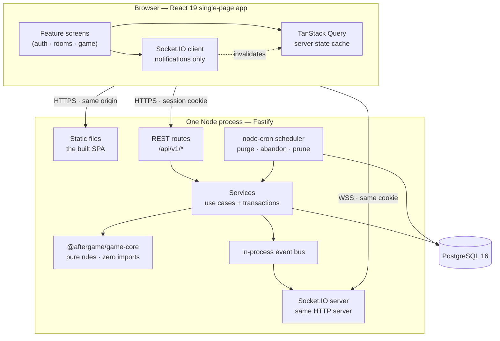
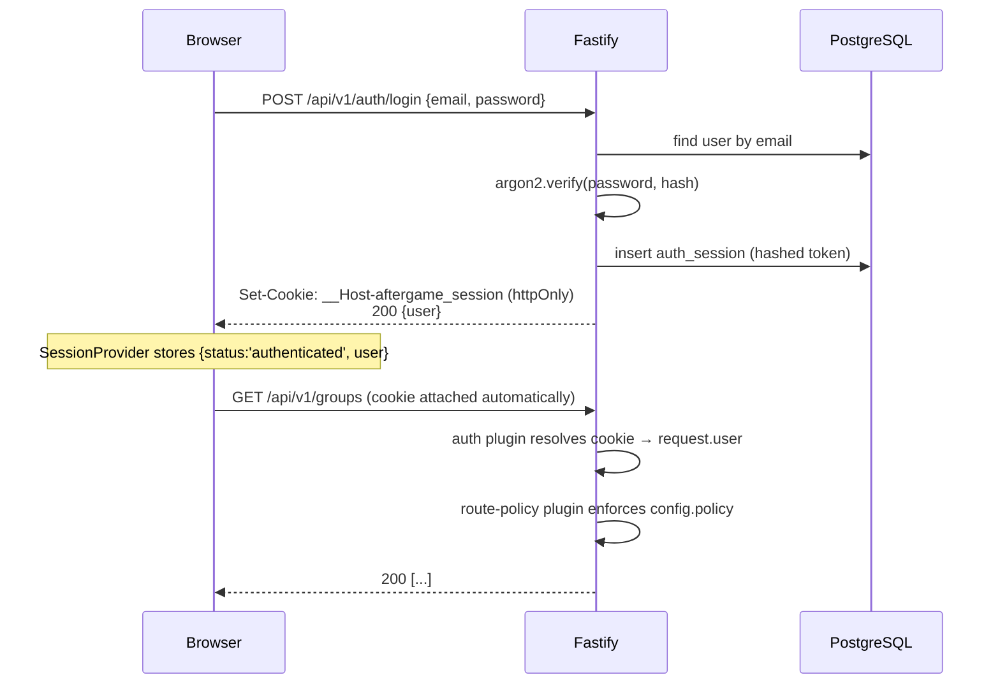
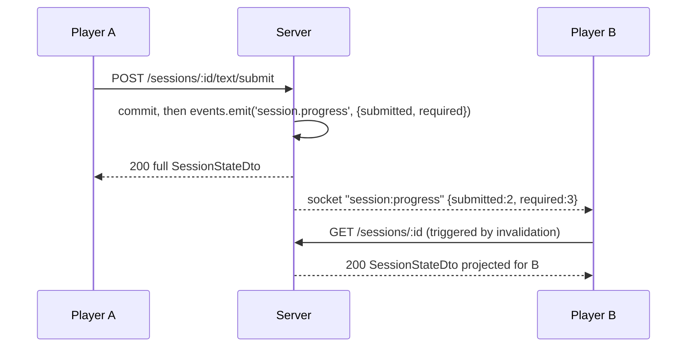
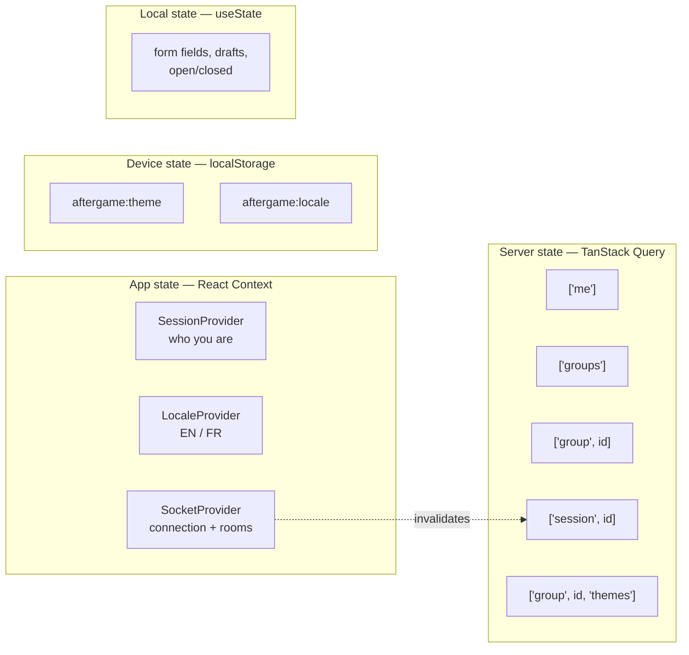
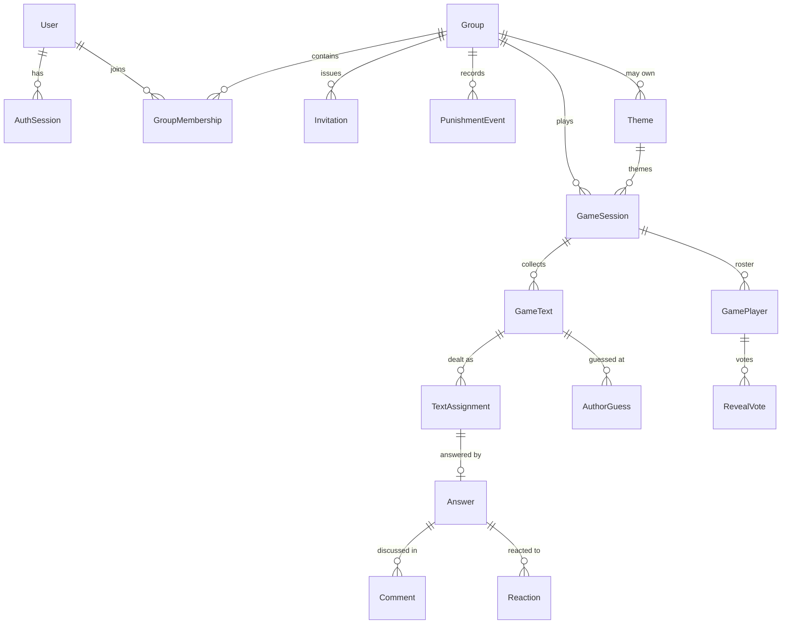
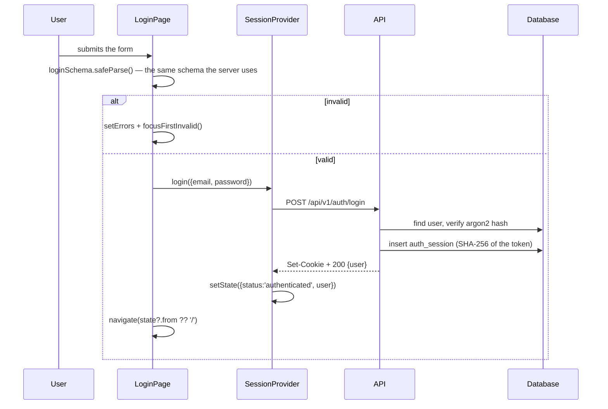
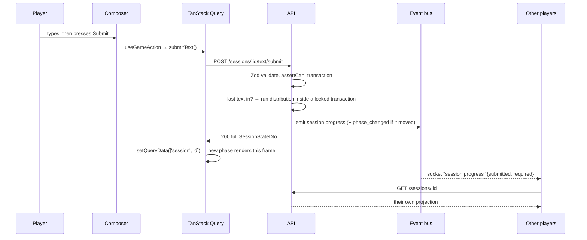
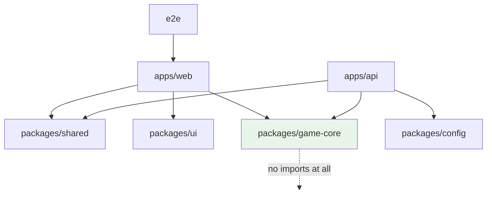

# 10 — Developer guide

**Who this is for:** someone who did not build Aftergame and now has to maintain and extend it.
It assumes you can read TypeScript and React, and explains everything else.

**How this fits with the other docs.** `docs/00`–`09` explain _why_ the system is the way it is —
decisions, architecture, security posture. This document explains _where things are and what to
touch_. When the two overlap, this one links rather than repeats. Read `00-spec-decisions.md`
before changing any game rule; the decisions there are load-bearing and have `D`-numbers
(`D8`, `D11`, …) referenced throughout the code.

**A note on the template this answers.** The request asked about dashboards, admin statistics,
"Today's Tracking", charts, roles/permissions UI, forgot-password, Redux, `pages/`, `layouts/`,
`services/`, `constants/`, `utils/`. Most of those do not exist here — this is a party game, not a
SaaS dashboard. Rather than invent them, §2 and §10 say plainly what exists instead and, where a
feature is genuinely absent, what building it would involve. Sections that would be empty are
marked **Not present** with the reason.

---

## Table of contents

1. [Project overview](#1-project-overview)
2. [Folder structure](#2-folder-structure)
3. [Feature-by-feature guide](#3-feature-by-feature-guide)
4. [Component guide](#4-component-guide)
5. [State management](#5-state-management)
6. [Routing guide](#6-routing-guide)
7. [Authentication guide](#7-authentication-guide)
8. [Database guide](#8-database-guide)
9. [API guide](#9-api-guide)
10. [How to modify the application](#10-how-to-modify-the-application)
11. [Data flow](#11-data-flow)
12. [Dependency map](#12-dependency-map)
13. [Best practices used in this project](#13-best-practices-used-in-this-project)
14. [Improvement opportunities](#14-improvement-opportunities)
15. [File index](#15-file-index)

---

## 1. Project overview

### 1.1 What the application is for

Aftergame is an **anonymous social party game for private groups of friends**. A group ("room")
opens a game, picks a theme, and every player writes one short anonymous text. The server shuffles
those texts and deals them out — never back to their own author — and each player answers the
texts they receive, also anonymously. Everyone then reads the whole timeline together, comments,
reacts, and optionally guesses who wrote what. At the end the group votes on whether to reveal the
authors: **unanimously or not at all**. Then the game is deleted.

Two mechanics make it more than a quiz:

- **Punishment.** A host can punish a player, who then has to answer _more_ texts in the next
  game. Three consecutive punishments and they sit the next game out entirely. The counter is
  per-group and resets when they complete a game unpunished.
- **Anonymity as a hard guarantee.** Not "we hide names in the UI" — the server never sends an
  identity the viewer is not entitled to. This is the single most important property in the
  codebase and it shapes the architecture (§1.9).

### 1.2 Architecture in one picture



**One process, one bundle, one database.** In production Fastify serves both the API under
`/api/v1` and the built React app from `/`. This is deliberate, not lazy — it removes CORS
entirely, lets the session cookie use the `__Host-` prefix (the strongest cookie there is), keeps
WebSocket upgrades on the same host, and fits any free hosting tier. In development Vite proxies
`/api` and `/socket.io` to Fastify, so the code sees one origin in both.

### 1.3 Technologies

| Layer        | Choice                                                                         | Where configured                     |
| ------------ | ------------------------------------------------------------------------------ | ------------------------------------ |
| Monorepo     | pnpm workspaces + Turborepo                                                    | `pnpm-workspace.yaml`, `turbo.json`  |
| Language     | TypeScript, strict + `noUncheckedIndexedAccess` + `exactOptionalPropertyTypes` | `tsconfig.base.json`                 |
| Backend      | Fastify 5                                                                      | `apps/api/src/app.ts`                |
| Database     | PostgreSQL 16 via Prisma 6                                                     | `apps/api/prisma/schema.prisma`      |
| Frontend     | React 19 + Vite 6                                                              | `apps/web/vite.config.ts`            |
| Styling      | Tailwind CSS 4 + OKLCH design tokens                                           | `packages/ui/src/tokens.css`         |
| Server state | TanStack Query v5                                                              | `apps/web/src/shared/api/queries.ts` |
| Realtime     | Socket.IO                                                                      | `apps/api/src/realtime/server.ts`    |
| Validation   | Zod (shared client + server)                                                   | `packages/shared/src/schemas/`       |
| Tests        | Vitest, Testing Library, fast-check, Playwright, axe-core                      | §13.9                                |

Two things are deliberately absent: **no Redux, no Zustand, no state library at all** beyond
TanStack Query plus three small React contexts (§5); and **no Redis, no queue, no microservices**
(`docs/01-architecture.md` §11).

### 1.4 How the frontend talks to the backend

Every call goes through one function, `apiFetch` in
[`apps/web/src/shared/api/client.ts`](../apps/web/src/shared/api/client.ts):

```ts
const response = await fetch(`/api/v1${path}`, {
  ...init,
  credentials: 'same-origin', // this is what carries the session cookie
  headers: { 'content-type': 'application/json', ...init.headers },
});
```

Three consequences worth internalising:

1. **Relative URLs.** There is no API base URL anywhere. Same origin in dev and prod (§1.2).
2. **Cookies, not tokens.** No `Authorization` header, no token in `localStorage`. The browser
   attaches an httpOnly cookie the JavaScript cannot read.
3. **Errors are typed.** A non-2xx response becomes an `ApiError` carrying a stable `code`
   (`SESSION_PHASE_INVALID`, `MEMBER_GAME_BLOCKED`, …). The client maps that code to translated
   copy in [`shared/lib/error-copy.ts`](../apps/web/src/shared/lib/error-copy.ts). **Never match
   on the English message** — it changes and it is translated.

### 1.5 Authentication flow (summary — full detail in §7)



There are **no JWTs and no refresh tokens**. The session is an opaque random token; only its
SHA-256 hash is stored. Expiry slides forward at most hourly to avoid a write per request.

### 1.6 Routing

Client-side, React Router v7, five routes, all declared in one file
([`apps/web/src/app/router.tsx`](../apps/web/src/app/router.tsx)). See §6.

### 1.7 State management

Four kinds, no library beyond TanStack Query. See §5 for the decision table.

### 1.8 Database architecture

16 tables. Users and groups persist; **game content is deliberately temporary** and hard-deleted
after a grace window (`D11`). Full detail in §8 and `docs/03-database-schema.md`.

### 1.9 API architecture — the four layers

```
Transport   *.routes.ts     HTTP shape, Zod parsing, status codes. No business logic.
    ↓
Application *.service.ts    Use cases, transactions, authorization, event emission.
    ↓
Domain      game-core       Pure rules. No imports at all. No clock, no randomness.
    ↓
Persistence *.repository.ts Prisma queries. Returns entities, never DTOs.
```

Dependencies point **downward only**. Three custom ESLint rules enforce it
(`packages/eslint-rules/`):

| Rule                             | Stops you from                               |
| -------------------------------- | -------------------------------------------- |
| `no-prisma-outside-repositories` | Reaching for Prisma in a service or route    |
| `no-imports-in-game-core`        | Adding _any_ import to the domain package    |
| `no-identity-fields-in-dto`      | Putting an author id into a serialized shape |

**Why `game-core` has no imports at all.** Not Prisma, not Fastify, not `node:crypto`. Time and
randomness are parameters, never ambient. That is what lets every interesting rule — how texts
are shuffled, when a punishment resets, who may see a name — be tested ten thousand times a
second against generated input with no database.

---

## 2. Folder structure

### Repository root

```
aftergame/
├── apps/
│   ├── api/            the Fastify server (also serves the built SPA in production)
│   └── web/            the React single-page app
├── packages/
│   ├── shared/         contracts: Zod schemas, DTO types, error codes, constants
│   ├── game-core/      the rules of the game — pure functions, zero dependencies
│   ├── ui/             design tokens + shared component primitives
│   ├── config/         environment variable loading and validation
│   └── eslint-rules/   three custom lint rules that enforce the architecture
├── e2e/                Playwright browser tests (whole stack, real browser)
├── docs/               this handbook and the nine design documents
├── docker/             container support files
├── scripts/            repo-level shell scripts
├── Dockerfile          production image
├── Caddyfile           reverse proxy config for self-hosting with TLS
├── turbo.json          task graph and caching
└── tsconfig.base.json  the strict TypeScript settings every package extends
```

> **Stray directory:** there is an untracked `WHO/` folder at the root containing only a nested
> `.git`. It is not part of the project and not tracked. Safe to delete; see §14.

### `apps/api/` — the backend

```
apps/api/
├── prisma/
│   ├── schema.prisma        the single source of truth for the database
│   ├── migrations/          two migrations, applied in order, never edited after merge
│   ├── seed.ts              development seed data
│   └── seed-cli.ts          CLI wrapper for `pnpm db:seed`
├── src/
│   ├── main.ts              composition root: load env → build app → seed themes → listen
│   ├── app.ts               builds the Fastify instance. Does NOT listen (so tests can inject)
│   ├── plugins/             cross-cutting concerns, registered in order
│   ├── modules/             one folder per feature, four files each
│   ├── lib/                 small utilities with no feature knowledge
│   ├── jobs/                the cron scheduler and its maintenance jobs
│   └── realtime/            the Socket.IO server
├── scripts/                 e2e server harness, performance check
└── tests/                   integration + anonymity test suites
```

**`src/plugins/` — Purpose.** Cross-cutting behaviour that every route needs, registered once in
`app.ts` in a deliberate order.

| File                 | What it does                                                  | Order matters because                                              |
| -------------------- | ------------------------------------------------------------- | ------------------------------------------------------------------ |
| `request-context.ts` | Generates a request id for logs and error responses           | Everything else logs                                               |
| `readiness.ts`       | Backs `GET /readyz`                                           | —                                                                  |
| `prisma.ts`          | Attaches `app.prisma` and `app.transaction`                   | Services need it                                                   |
| `security.ts`        | Helmet, CSP, rate limits, Origin checks                       | Before routes                                                      |
| `static.ts`          | Serves the built SPA                                          | Before `error-handler`, whose not-found falls back to `index.html` |
| `error-handler.ts`   | Turns thrown errors into RFC 9457 `problem+json`              | After static                                                       |
| `auth.ts`            | Resolves the session cookie into `request.user`               | Before route-policy                                                |
| `services.ts`        | **Dependency injection.** Builds every repository and service | Before routes                                                      |
| `route-policy.ts`    | **Refuses to boot if a route forgot its policy**              | Before every route                                                 |

**Use it when:** the behaviour applies to many routes and has no feature identity.
**Do not use it when:** the logic belongs to one feature — that goes in `modules/`.

**`src/modules/` — Purpose.** One folder per feature. Each follows the same four-file shape:

```
modules/sessions/
├── sessions.routes.ts       HTTP surface. Parses params, calls a service, returns.
├── sessions.service.ts      Use cases, transactions, authorization, events.
├── sessions.repository.ts   Prisma queries. The ONLY place Prisma may be imported.
└── sessions.mapper.ts       Entity → DTO. The anonymity projection lives here.
```

Current modules: `auth`, `groups`, `memberships`, `invitations`, `punishments`, `sessions`,
`themes`, `health`.

**Use it when:** adding a feature with its own routes and rules.
**Do not use it when:** the code is a pure rule with no I/O — that belongs in `game-core`, where
it can be property-tested.

**`src/lib/` — Purpose.** Small, feature-agnostic utilities.

| File                 | Purpose                                                        |
| -------------------- | -------------------------------------------------------------- |
| `authorize.ts`       | The role/permission model. `can(action, actor, target)` — §7.6 |
| `password.ts`        | Argon2id hashing                                               |
| `tokens.ts`          | Session token generation and hashing                           |
| `invite-code.ts`     | Crockford base32 codes, unambiguous when read aloud            |
| `attempt-limiter.ts` | Per-account login throttling                                   |
| `validate.ts`        | `parseOrThrow` — Zod → `ValidationError`                       |
| `db.ts`              | Prisma error helpers (`isUniqueViolation`)                     |
| `event-bus.ts`       | Typed in-process pub/sub                                       |

**`src/jobs/`** — `scheduler.ts` registers one `node-cron` task; `maintenance.ts` holds the work
(purge expired sessions, abandon stale ones, prune auth sessions, expire invitations). Each takes
a PostgreSQL advisory lock so two instances never double-run.

**`src/realtime/server.ts`** — the Socket.IO server. Authenticates at the handshake using the same
cookie, joins clients to `group:{id}` and `session:{id}` rooms after authorising, and translates
event-bus events into room broadcasts. **It never sends game content** — only ids and counts.

### `apps/web/` — the frontend

```
apps/web/
├── index.html               the shell; contains the pre-paint theme script
├── src/
│   ├── main.tsx             mounts <AppRouter /> into #root
│   ├── app/router.tsx       every route + every provider, in one file
│   ├── features/            business features (see below)
│   ├── shared/              things more than one feature uses
│   └── styles/index.css     Tailwind entry, base layer, focus ring, reduced-motion
└── tests/                   component and integration tests
```

**`src/features/` — Purpose.** One folder per business capability. A feature owns its screens, its
API calls, and any component only it uses.

```
features/
├── auth/      SessionProvider, RequireAuth, LoginPage, RegisterPage, AuthLayout
├── groups/    room list, room detail, theme manager, punishment history, lobby/ panels
└── game/      the five phase screens, game.api.ts, useGame.ts, components/, hooks/
```

**Use it when:** the code is about one capability and would make no sense in another app.
**Do not use it when:** two features need it — promote it to `shared/`, or to `packages/ui` if it
is presentational and has no app knowledge.

**`src/shared/` — Purpose.** Cross-feature infrastructure. **This is the project's `services/`,
`utils/`, `constants/`, `hooks/` and `config/` folder combined** — the template's separate folders
do not exist here, and that is a deliberate choice at this size.

| Folder               | Contains                                                                      | Maps to the template's            |
| -------------------- | ----------------------------------------------------------------------------- | --------------------------------- |
| `shared/api/`        | `client.ts` (fetch + errors), `queries.ts` (query keys + client config)       | `services/`                       |
| `shared/components/` | `AppShell`, `GroupRail`, `GroupSidebar`, `LanguageMenu`, `RouteErrorBoundary` | `layouts/` + shared `components/` |
| `shared/hooks/`      | `useTheme`, `useMediaQuery`                                                   | `hooks/`                          |
| `shared/i18n/`       | `translations.ts` (the EN + FR dictionary), `LocaleProvider.tsx`              | —                                 |
| `shared/lib/`        | `error-copy.ts`, `form.ts`                                                    | `utils/`                          |
| `shared/realtime/`   | `SocketProvider.tsx`                                                          | —                                 |

**Template folders that do not exist, and why:**

- **`pages/`** — screens live inside their feature (`features/game/GamePage.tsx`), so a feature is
  one folder rather than three. Routing is centralised in `app/router.tsx`.
- **`layouts/`** — there are exactly two (`AppShell` for signed-in, `AuthLayout` for signed-out),
  so they sit with the code that uses them rather than in a folder of two files.
- **`constants/`** — constants that both client and server need must be shared, so they live in
  `packages/shared/src/constants.ts`. A client-only copy would be a second source of truth.
- **`types/`** — types are shared contracts, so they live in `packages/shared/src/dto/`.
- **`assets/`** — there are no image or font assets. Icons come from `lucide-react` as React
  components; there is no webfont (see §14).
- **`config/`** — environment handling is server-side only, in `packages/config`. The client has
  no configuration: it uses relative URLs and reads the theme and locale from `localStorage`.

### `packages/`

| Package        | Purpose                                                                               | Depend on it from           | Never                                 |
| -------------- | ------------------------------------------------------------------------------------- | --------------------------- | ------------------------------------- |
| `shared`       | The contract between client and server: Zod schemas, DTO types, `ERROR_CODES`, limits | both apps                   | put runtime logic here                |
| `game-core`    | The rules: distribution, phases, punishment, visibility                               | api (and web, for previews) | add an import — a lint rule blocks it |
| `ui`           | Design tokens + primitives (`Button`, `Field`, `Card`, `Avatar`, `Drawer`, …)         | web                         | import app state or i18n into it      |
| `config`       | `loadEnv()` with a Zod schema; a bad value exits the process                          | api                         | use it in the browser                 |
| `eslint-rules` | Three custom rules enforcing the architecture                                         | the lint config             | —                                     |

`packages/game-core` is gated at **100% branch coverage** and tested with property tests over
10,000 generated games.

### `e2e/`

Playwright tests against a real browser and a real database, on desktop and a Pixel 5 viewport.

| Spec                    | Proves                                                                             |
| ----------------------- | ---------------------------------------------------------------------------------- |
| `smoke.spec.ts`         | The server serves the SPA, the API, and deep links                                 |
| `full-game.spec.ts`     | Three browsers play a whole game live                                              |
| `accessibility.spec.ts` | WCAG 2.1 AA via axe in both themes, **no rules disabled**; plus touch-target sizes |
| `french.spec.ts`        | The whole app plays in French                                                      |
| `resilience.spec.ts`    | Dropped sockets, force-advance, purged games                                       |
| `punishment.spec.ts`    | Blocked players are told why                                                       |
| `csp.spec.ts`           | The production CSP allows the app and blocks what it should                        |
| `phase10.spec.ts`       | Group-written themes and reactions                                                 |

`helpers/world.ts` sets games up through the **API**, not the UI, so a spec spends its time on the
behaviour it names.

---

## 3. Feature-by-feature guide

### 3.1 Authentication

**Purpose.** Register, sign in, stay signed in, sign out.

**Files.**

| File                                                            | Role                                                                                 |
| --------------------------------------------------------------- | ------------------------------------------------------------------------------------ |
| `apps/web/src/features/auth/SessionProvider.tsx`                | Holds `loading \| anonymous \| authenticated`; exposes `login`, `register`, `logout` |
| `apps/web/src/features/auth/RequireAuth.tsx`                    | Route guard — a redirect for convenience, **not** a security control                 |
| `apps/web/src/features/auth/LoginPage.tsx` / `RegisterPage.tsx` | The two forms                                                                        |
| `apps/web/src/features/auth/AuthLayout.tsx`                     | The centred card both forms sit in                                                   |
| `apps/api/src/modules/auth/*`                                   | routes → service → repository, plus `auth.cookies.ts`                                |
| `apps/api/src/plugins/auth.ts`                                  | Resolves the cookie into `request.user` on every request                             |
| `packages/shared/src/schemas/auth.ts`                           | The Zod schemas both sides validate with                                             |

**How it works.** On mount `SessionProvider` calls `GET /auth/me`. A 401 is a _normal_ answer
meaning "nobody is signed in", not an error. Signing in sets an httpOnly cookie and the provider
stores the user. That stored user is a **cache of what the server knows**, never the source of
truth — every protected request is authorised again server-side.

**Data flow.** §11.1.

**Extending it.** Adding a field to registration: schema in `packages/shared/src/schemas/auth.ts`
→ column in `schema.prisma` + migration → `auth.repository.ts` → `auth.service.ts` → a `<Field>`
in `RegisterPage.tsx` → two dictionary entries in `translations.ts`.

**Common mistakes.**

- Trying to read the session cookie in JavaScript. It is `httpOnly` by design.
- Treating `RequireAuth` as security. It is not; the API is.
- Adding a client-side role check and assuming it protects anything.

### 3.2 Groups (rooms)

**Purpose.** Create a room, join one with an 8-character code, see who is in it, manage roles,
punish and forgive, write custom themes.

**Files.** `features/groups/GroupsPage.tsx` (the list), `GroupDetailPage.tsx` (one room),
`lobby/` (`RoomHeader`, `RoomCode`, `ThemeGrid`, `PlayerList`, `LobbyPanel`), `ThemeManager.tsx`,
`PunishmentHistory.tsx`, `groups.api.ts`. Server: `modules/groups`, `modules/memberships`,
`modules/invitations`, `modules/punishments`, `modules/themes`.

**How it works.** `GroupDetailPage` composes a header and a `LobbyPanel`; the panel shows either
the live game or the theme picker plus the player list. Host-only controls are hidden from
non-hosts _and_ rejected by the server.

**Common mistakes.**

- Hiding a host control in the UI and forgetting `assertCan` in the service. The UI is a
  convenience; the service is the rule.
- Adding a theme field without adding it to `THEME_*_MAX_LENGTH` in shared constants.

### 3.3 The game

**Purpose.** The whole play loop.

**Files.** `features/game/GamePage.tsx` switches on `state.phase` and renders one of
`LobbyScreen`, `WritingScreen`, `AnsweringScreen`, `TimelineScreen`, `RevealScreen`. Shared
pieces in `components/` (`Composer`, `CommentThread`, `GuessWidget`, `ReactionBar`,
`PhaseProgress`, `ThemeBanner`, `PurgeNotice`). Data via `useGame.ts` and `game.api.ts`.

**How it works — the key idea.** The client **never decides what phase it is in**. It renders the
phase the server reports:

```tsx
{
  state.phase === 'WRITING' && <WritingScreen state={state} />;
}
{
  state.phase === 'ANSWERING' && <AnsweringScreen state={state} />;
}
```

That is why a player who reconnects lands exactly where the game actually is, and why the client
cannot show a name the payload does not contain — because the payload does not contain one.

**Three hooks carry all game mutations** (`useGame.ts`):

| Hook                 | Use for                                          | Behaviour                                                                    |
| -------------------- | ------------------------------------------------ | ---------------------------------------------------------------------------- |
| `useGame(sessionId)` | Reading the game                                 | Subscribes to the session room; one query                                    |
| `useGameAction`      | Actions returning the new state                  | Writes the response into the cache — the new phase renders in the same frame |
| `useGameEffect`      | Actions returning 204 (comment, guess, reaction) | Invalidates and refetches                                                    |

**Extending it.** A new player action: add the route (`sessions.routes.ts`) → service method →
repository → an `api` function in `game.api.ts` → call it with `useGameAction` or `useGameEffect`
→ add copy to both dictionaries.

**Common mistakes.**

- Adding local state that mirrors the server's phase. Don't — read `state.phase`.
- Using `useGameAction` for a 204 endpoint. It writes `undefined` into the cache.
- Adding an identity field to a timeline DTO. A lint rule and the anonymity suite will stop you,
  and they are right.

### 3.4 Real-time

**Purpose.** Everyone's screen moves together without polling.

**Files.** `apps/web/src/shared/realtime/SocketProvider.tsx`,
`apps/api/src/realtime/server.ts`, `apps/api/src/lib/event-bus.ts`.

**How it works.** Clients **never write over the socket**. All writes are REST; the service
commits, publishes to the event bus, and the gateway broadcasts a _notification_ carrying ids and
counts. The client reacts by invalidating a query and refetching — through the same projection and
the same authorization as any other read.



**Why the extra round trip is the point.** A channel that never carries identity cannot leak it,
and there is no second serialization path to keep in step with the first.

### 3.5 Internationalisation

**Purpose.** The whole app in English and French.

**Files.** `shared/i18n/translations.ts` (one flat dictionary), `LocaleProvider.tsx`,
`shared/components/LanguageMenu.tsx`.

**How it works.** `en` is an object `as const`; `TranslationKey = keyof typeof en`; `fr` is typed
`Record<TranslationKey, string>` — so **a missing French string is a compile error**. `useT()`
returns `t(key, values?)` with `{name}` interpolation; `usePlural()` picks between two keys.

**Guarded by** `apps/web/tests/i18n.test.ts`, which reads the source and fails on copy that never
reached the dictionary, and `e2e/specs/french.spec.ts`, which plays a whole game in French.

**Common mistakes.**

- A template literal in JSX (`` `Created ${name}` ``). Use `t('rooms.created', { name })`.
- A singular/plural ternary. Use `usePlural`.
- Assuming the guard catches everything — it has known blind spots (§14).

---

## 4. Component guide

### 4.1 `packages/ui` primitives

These have **no app knowledge**: no i18n, no routing, no data fetching. Every string they display
arrives as a prop. That is why `Drawer` takes a `closeLabel` and `Field` takes `revealLabels`.

#### `Button`

| Prop                                    | Type                                      | Default     | Notes                                         |
| --------------------------------------- | ----------------------------------------- | ----------- | --------------------------------------------- |
| `variant`                               | `primary \| secondary \| ghost \| danger` | `secondary` | One primary per screen                        |
| `size`                                  | `sm \| md \| icon`                        | `md`        | See below                                     |
| `pending`                               | `boolean`                                 | `false`     | Disables and shows a spinner over the label   |
| …plus every native `<button>` attribute |                                           |             | `type` defaults to `"button"`, never `submit` |

**Sizes.** `md` is 44×44 — the touch minimum. `sm` is drawn at 32px but carries a `.touch-target`
pseudo-element that expands the _hit area_ to 44px without changing layout. `icon` is a real
44×44 square, for chrome that sits beside a native `<select>` (which cannot carry a
pseudo-element).

**Reuse it** for every button. **Do not reuse it** for navigation — use `<Link>`, so
middle-click and "open in new tab" work.

#### `Field`

A labelled input. The label is always present (visually hidden at most). Errors and hints are
wired through `aria-describedby`, so a screen reader reads the problem _with_ the field.

| Prop            | Notes                                                           |
| --------------- | --------------------------------------------------------------- |
| `id`, `label`   | Required. `id` is also what `focusFirstInvalid` targets         |
| `error`, `hint` | Rendered below, announced via `role="alert"`                    |
| `labelHidden`   | Keeps the label for screen readers only                         |
| `required`      | Adds an `aria-hidden` asterisk; the accessible name stays clean |
| `revealLabels`  | `{ show, hide }` — required to get a password toggle            |

#### Others

| Component       | Purpose                                           | Reuse when                          | Avoid when                                           |
| --------------- | ------------------------------------------------- | ----------------------------------- | ---------------------------------------------------- |
| `Card`          | Bordered raised surface                           | Grouping related content            | You need padding — pass it via `className`           |
| `Skeleton`      | Loading placeholder shaped like the content       | Data is loading and layout is known | The shape is unknown — use `LoadingRegion`           |
| `LoadingRegion` | Screen-reader-only "loading" announcement         | Alongside skeletons                 | —                                                    |
| `EmptyState`    | Icon + title + description + action               | A list is legitimately empty        | An error occurred — say so instead                   |
| `Badge`         | Short status word (`neutral \| accent \| danger`) | Role, phase, count                  | Long text                                            |
| `ErrorText`     | `role="alert"` inline error                       | Form-level errors                   | Field errors — `Field` does those                    |
| `Avatar`        | Initials in a deterministic colour                | Rosters                             | It must be announced — it is `aria-hidden` by design |
| `Drawer`        | Radix dialog sliding from the left                | Mobile navigation                   | Anything not navigation                              |

### 4.2 Shared app components

| Component            | Purpose                                            | Notes                                                                         |
| -------------------- | -------------------------------------------------- | ----------------------------------------------------------------------------- |
| `AppShell`           | The signed-in layout: top bar, rail, sidebar, main | Renders **one** navigation tree — desktop inline or mobile drawer, never both |
| `GroupRail`          | Slim vertical strip of room avatars                | Names every room for assistive tech, not just initials                        |
| `GroupSidebar`       | The current room's roster                          | —                                                                             |
| `LanguageMenu`       | Native `<select>` EN/FR                            | Native on purpose: the platform picker is better than a rebuilt one           |
| `RouteErrorBoundary` | Catches render errors per route                    | Class component + a function fallback, so the fallback can use hooks          |

### 4.3 Feature components

`lobby/RoomHeader`, `lobby/RoomCode` (the chip _is_ the copy button), `lobby/ThemeGrid` (a
radiogroup with arrow-key roving tabindex), `lobby/PlayerList`, `lobby/LobbyPanel`;
`game/components/Composer` (textarea + counter + dictation), `CommentThread`, `GuessWidget`,
`ReactionBar`, `PhaseProgress`, `ThemeBanner`, `PurgeNotice`.

---

## 5. State management

**There is no Redux, Zustand, MobX or Recoil.** Four kinds of state, each with one home:



| Kind             | Tool              | Rule of thumb                                               |
| ---------------- | ----------------- | ----------------------------------------------------------- |
| Server data      | TanStack Query    | **Anything the server owns.** Never copy it into `useState` |
| Session identity | `SessionProvider` | Read with `useSession()`                                    |
| Language         | `LocaleProvider`  | Read with `useT()` / `usePlural()`                          |
| Socket           | `SocketProvider`  | Subscribe with `useSessionSubscription(id)`                 |
| Theme            | `useTheme()`      | Applied pre-paint by an inline script in `index.html`       |
| Everything else  | `useState`        | If it dies with the component, keep it local                |

**Query keys are centralised** in `shared/api/queries.ts` so the socket layer can invalidate
precisely (`['session', id]`) rather than everything.

**Defaults worth knowing** (`createQueryClient`): retry stops on any 4xx (a 403 will not become
allowed by asking again); `staleTime: 30s`; `refetchOnWindowFocus: true` — the belt to the
socket's braces, recovering a client whose socket slept with the laptop lid.

---

## 6. Routing guide

All routes are in [`apps/web/src/app/router.tsx`](../apps/web/src/app/router.tsx).

| Path                                | Component         | Protected |
| ----------------------------------- | ----------------- | --------- |
| `/login`                            | `LoginPage`       | no        |
| `/register`                         | `RegisterPage`    | no        |
| `/`                                 | `GroupsPage`      | yes       |
| `/groups/:groupId`                  | `GroupDetailPage` | yes       |
| `/groups/:groupId/games/:sessionId` | `GamePage`        | yes       |
| `*`                                 | redirect to `/`   | —         |

**Protected routes** are wrapped in `<Protected>`, which composes four things in order:

```tsx
<RequireAuth>          // redirect to /login if anonymous
  <SocketProvider>     // one socket for the whole signed-in app
    <AppShell>         // top bar + navigation + <main>
      <RouteErrorBoundary>{children}</RouteErrorBoundary>
    </AppShell>
  </SocketProvider>
</RequireAuth>
```

**Dynamic routes** use `useParams()`. Always default them —
`const { groupId = '' } = useParams()` — because the type is `string | undefined`.

**Admin routes: not present.** There is no admin area. Authority is per-room (`OWNER`, `COHOST`,
`MEMBER`), not global. Building a global admin area would need a new user-level role column, a
new policy in `authorize.ts`, and new routes — see §10.17.

**Nested routes: not used.** The tree is two levels deep; `<Protected>` provides the shared shell,
which is what nested layout routes would otherwise buy.

**Adding a page.** 1) create `features/<feature>/MyPage.tsx`; 2) add a `<Route>` in `router.tsx`
(wrap in `<Protected>` if signed-in-only); 3) add copy to both dictionaries; 4) if it needs
server data, add an api function and a query key. **Removing one:** delete the route, the
component, its api functions, its query key, and its dictionary entries — the i18n test will flag
orphaned keys only if they were the sole user, so grep.

---

## 7. Authentication guide

### 7.1 Registration and login

`POST /auth/register` and `POST /auth/login` both validate with the shared Zod schema, then set
the session cookie and return `{ user }`.

### 7.2 The session

- **Opaque random token**, not a JWT. Only its **SHA-256 hash** is stored, so a database leak does
  not yield usable sessions.
- **Sliding expiry**: extended at most once an hour (`SESSION_REFRESH_AFTER_MS`), so a normal
  request does not write to the database.
- **TTL** from `SESSION_TTL_DAYS`.
- **IP addresses are hashed** with the app secret before storage — useful for "recognise this
  device", useless for anything else.

### 7.3 The cookie

Defined in [`auth.cookies.ts`](../apps/api/src/modules/auth/auth.cookies.ts):

| Attribute  | Value                             | Why                                                                                                                |
| ---------- | --------------------------------- | ------------------------------------------------------------------------------------------------------------------ |
| name       | `__Host-aftergame_session` (prod) | The prefix is only honoured with `Secure`, `Path=/`, no `Domain` — a compromised sibling subdomain cannot write it |
|            | `aftergame_session` (dev)         | Browsers reject `__Host-` over plain http                                                                          |
| `httpOnly` | true                              | An XSS bug cannot exfiltrate the session                                                                           |
| `secure`   | production only                   | —                                                                                                                  |
| `sameSite` | `lax`                             | `strict` would drop the cookie when someone follows an invite link from a chat app                                 |
| `path`     | `/`                               | Required by the prefix                                                                                             |

### 7.4 Logout

`POST /auth/logout` deletes the row and clears the cookie. `POST /auth/logout-all` ends every
session for the user. The client sets itself to `anonymous` in a `finally` — **logging out must
never fail**.

### 7.5 JWT / refresh tokens — not used

Deliberately. Opaque sessions are revocable server-side; a JWT is not, which is why JWT systems
need refresh-token machinery. There is no such machinery here and none is needed.

### 7.6 Permissions and roles

Roles are **per group**, not global: `OWNER`, `COHOST`, `MEMBER`, plus a status of `ACTIVE` or
`GAME_BLOCKED`. The whole model is one pure function in
[`lib/authorize.ts`](../apps/api/src/lib/authorize.ts):

```ts
export function can(action: GroupAction, actor: Actor, target?: Target): boolean;
```

`GROUP_ACTIONS` is a **closed union of 23 actions**, and the `switch` is exhaustive — adding an
action without handling it fails to compile.

Two asymmetries worth knowing:

- **Co-hosts have host powers but cannot act on each other or on the owner.** Without that, two
  co-hosts can demote each other and a co-host can eject the owner from their own room.
- **Nobody can act on themselves.** Leaving has its own action (`member:leave`) with its own rule:
  the owner must transfer ownership first, or the room is left with nobody able to run it.

**Every `/api` route must declare `config.policy`.** A route that does not is a **boot failure** —
`plugins/route-policy.ts` throws at registration. Declaring anything other than `public` also
attaches authentication automatically, so a route cannot say "members only" and forget to require
a session.

### 7.7 Forgot password — not implemented

There is no reset flow, no email sending, and no mail dependency in the project. Building it would
need: a `password_reset_tokens` table (hashed token, expiry, single use); `POST /auth/forgot` and
`POST /auth/reset`; an email transport; rate limiting on both routes; a route that responds
identically whether or not the account exists (or it becomes an account-enumeration oracle); and
two new screens. See §10.9.

---

## 8. Database guide

### 8.1 The tables



| Table             | Holds                                        | Lifetime                                    |
| ----------------- | -------------------------------------------- | ------------------------------------------- |
| `User`            | Account, username, argon2 hash               | Permanent                                   |
| `AuthSession`     | Hashed session tokens                        | Until expiry; pruned hourly                 |
| `Group`           | A room                                       | Permanent                                   |
| `GroupMembership` | Role + status + `consecutivePunishments`     | Permanent                                   |
| `Invitation`      | Invite codes                                 | Until expiry                                |
| `PunishmentEvent` | Audit log of punish/forgive                  | **Permanent — survives game purges**        |
| `Theme`           | System themes and group-written ones         | Permanent                                   |
| `GameSession`     | One game, its phase, its display seed        | **Purged after the grace window**           |
| `GamePlayer`      | Who is in the game, and whether they left    | Purged with the session                     |
| `GameText`        | What someone wrote                           | Purged                                      |
| `TextAssignment`  | Who was dealt which text                     | Purged. **Never exposed to anyone**         |
| `Answer`          | A reply to a dealt text                      | Purged                                      |
| `Comment`         | Discussion, optionally anonymous per comment | Purged                                      |
| `Reaction`        | Emoji tallies — counted, never attributed    | Purged                                      |
| `AuthorGuess`     | Who someone thinks wrote what                | Purged                                      |
| `RevealVote`      | Private YES/NO                               | Purged. **Write-only** — one query reads it |

### 8.2 Where data comes from

- **Users and groups**: created by people through the API.
- **System themes**: seeded on **every boot** by `seedThemes()` in
  `modules/themes/system-themes.ts`, idempotent by slug. It is at boot rather than in a release
  command because the failure it prevents is silent — a deployment that migrated but never seeded
  answers `/readyz` with a 200 and offers an empty theme picker.
- **Game content**: written by players, then deleted.

### 8.3 Migrations

```bash
# after editing schema.prisma, in apps/api:
pnpm db:migrate      # creates + applies a migration in development
pnpm db:deploy       # applies pending migrations in production
pnpm db:generate     # regenerates the Prisma client
pnpm db:studio       # a browser UI for the data
pnpm db:reset        # destroys and rebuilds the local database
```

**Rules.** Never edit a migration that has been merged — write a new one. Every schema change is
one migration plus one `schema.prisma` edit, committed together.

### 8.4 Adding a field

1. Add it to the model in `schema.prisma`.
2. `pnpm db:migrate` — name the migration for what it does.
3. Update the repository's `select`/`include`.
4. Update the mapper if it should reach the client — **and check `no-identity-fields-in-dto`
   will allow it**.
5. Update the DTO type in `packages/shared/src/dto/`.
6. If users type it, add a Zod schema and a bound in `constants.ts`.

### 8.5 Indexes

32 `@@index`/`@@unique` declarations. Two carry rules rather than performance:

- `(text_id, receiver_player_id)` unique — the database independently enforces "no player receives
  the same text twice", because a bug there silently ruins a game rather than throwing.
- One live session per group — enforced by a partial unique index (`D12`).

### 8.6 Seeders

`prisma/seed.ts` is **development sample data**, run with `pnpm db:seed`. Do not confuse it with
`system-themes.ts`, which is production seeding and runs at boot.

---

## 9. API guide

Base path `/api/v1`. **48 routes.** Every one declares a policy (§7.6). Errors are RFC 9457
`application/problem+json` carrying a stable `code`.

### 9.1 Auth — `modules/auth/`

| Method | Path               | Policy          | Purpose                    |
| ------ | ------------------ | --------------- | -------------------------- |
| POST   | `/auth/register`   | `public`        | Create an account, sign in |
| POST   | `/auth/login`      | `public`        | Sign in                    |
| POST   | `/auth/logout`     | `public`        | End this session           |
| POST   | `/auth/logout-all` | `authenticated` | End every session          |
| GET    | `/auth/me`         | `authenticated` | Who am I?                  |

### 9.2 Groups — `modules/groups/`

| Method | Path                                          | Policy               |
| ------ | --------------------------------------------- | -------------------- |
| GET    | `/groups`                                     | `authenticated`      |
| POST   | `/groups`                                     | `authenticated`      |
| GET    | `/groups/:groupId`                            | `group:read`         |
| PATCH  | `/groups/:groupId`                            | `group:rename`       |
| DELETE | `/groups/:groupId`                            | `group:delete`       |
| GET    | `/groups/:groupId/members`                    | `member:list`        |
| PATCH  | `/groups/:groupId/members/:userId`            | `member:promote`     |
| DELETE | `/groups/:groupId/members/:userId`            | `member:remove`      |
| POST   | `/groups/:groupId/leave`                      | `member:leave`       |
| POST   | `/groups/:groupId/transfer-ownership/:userId` | `ownership:transfer` |
| GET    | `/groups/:groupId/invitations`                | `invitation:list`    |
| POST   | `/groups/:groupId/invitations`                | `invitation:create`  |
| DELETE | `/groups/:groupId/invitations/:invitationId`  | `invitation:revoke`  |
| POST   | `/join`                                       | `authenticated`      |

### 9.3 Punishments — `modules/punishments/`

| Method | Path                                       | Policy               |
| ------ | ------------------------------------------ | -------------------- |
| POST   | `/groups/:groupId/members/:userId/punish`  | `punishment:punish`  |
| POST   | `/groups/:groupId/members/:userId/forgive` | `punishment:forgive` |
| GET    | `/groups/:groupId/punishments`             | `punishment:list`    |

### 9.4 Sessions — `modules/sessions/`

| Method       | Path                                                           | Policy           | Notes                                             |
| ------------ | -------------------------------------------------------------- | ---------------- | ------------------------------------------------- |
| POST         | `/groups/:groupId/sessions`                                    | `session:create` | Host opens a game                                 |
| GET          | `/groups/:groupId/session`                                     | `session:read`   | The room's live game, or null                     |
| GET          | `/sessions/:sessionId`                                         | `session:read`   | **The projection.** Everything the viewer may see |
| POST         | `/sessions/:sessionId/join`                                    | `session:join`   |                                                   |
| POST         | `/sessions/:sessionId/leave`                                   | `session:leave`  |                                                   |
| POST         | `/sessions/:sessionId/start`                                   | `session:host`   | Locks the roster                                  |
| POST         | `/sessions/:sessionId/cancel`                                  | `session:host`   |                                                   |
| POST         | `/sessions/:sessionId/advance`                                 | `session:host`   | Force-advance (`D14`)                             |
| POST         | `/sessions/:sessionId/end`                                     | `session:host`   | REVIEW → REVEAL                                   |
| POST         | `/sessions/:sessionId/close-voting`                            | `session:host`   |                                                   |
| PUT          | `/sessions/:sessionId/text`                                    | `session:play`   | Save a draft                                      |
| POST         | `/sessions/:sessionId/text/submit`                             | `session:play`   | **May trigger distribution**                      |
| PUT          | `/sessions/:sessionId/assignments/:assignmentId/answer`        | `session:play`   | Draft                                             |
| POST         | `/sessions/:sessionId/assignments/:assignmentId/answer/submit` | `session:play`   |                                                   |
| POST         | `/sessions/:sessionId/answers/:answerId/comments`              | `session:play`   |                                                   |
| PUT / DELETE | `/sessions/:sessionId/answers/:answerId/reactions`             | `session:play`   |                                                   |
| PUT          | `/sessions/:sessionId/texts/:textId/guess`                     | `session:play`   |                                                   |
| POST         | `/sessions/:sessionId/reveal-vote`                             | `session:play`   | Write-only                                        |

### 9.5 Themes — `modules/themes/`

| Method | Path                               | Policy         |
| ------ | ---------------------------------- | -------------- |
| GET    | `/groups/:groupId/themes`          | `theme:read`   |
| GET    | `/groups/:groupId/themes/custom`   | `theme:read`   |
| POST   | `/groups/:groupId/themes`          | `theme:manage` |
| PUT    | `/groups/:groupId/themes/:themeId` | `theme:manage` |
| DELETE | `/groups/:groupId/themes/:themeId` | `theme:manage` |

Themes are group-scoped: a global list would hand every group's prompts to every other one
(`D19`).

### 9.6 Health — `modules/health/`

`GET /healthz` (process alive) and `GET /readyz` (database reachable, migrations applied). Both
outside `/api`, so no policy applies.

### 9.7 How the frontend calls them

Never directly. Each feature has an api module (`features/game/game.api.ts`,
`features/groups/groups.api.ts`) of thin typed functions over `apiFetch`/`apiPost`/`apiPut`,
called from a TanStack Query hook. **Do not call `fetch` from a component.**

---

## 10. How to modify the application

| I want to…                                                | Go to                                                                                                                                                                                                                                                               |
| --------------------------------------------------------- | ------------------------------------------------------------------------------------------------------------------------------------------------------------------------------------------------------------------------------------------------------------------- |
| **10.1 Change the room screen**                           | `features/groups/GroupDetailPage.tsx` and `features/groups/lobby/*`                                                                                                                                                                                                 |
| **10.2 Change the sidebar**                               | `shared/components/GroupSidebar.tsx`; the rail is `GroupRail.tsx`                                                                                                                                                                                                   |
| **10.3 Add a top-bar item**                               | `TopBar` inside `shared/components/AppShell.tsx`. Use `<Button size="icon">` for icon-only — it is a real 44px target                                                                                                                                               |
| **10.4 Change theme colours**                             | `packages/ui/src/tokens.css`. **Edit both blocks** — `@theme` (light) and `:root.dark`. Never put a raw hex in a component                                                                                                                                          |
| **10.5 Change fonts**                                     | `apps/web/src/styles/index.css`, the `body` rule. It is a system font stack today. A webfont means self-hosting (the CSP blocks external hosts), `font-display: swap`, and a preload                                                                                |
| **10.6 Change spacing / radius / motion**                 | `tokens.css`: `--radius-*`, `--duration-*`, `--ease-*`, `--z-*`                                                                                                                                                                                                     |
| **10.7 Change wording**                                   | `shared/i18n/translations.ts` — **both `en` and `fr`**. TypeScript fails the build if you add to one only                                                                                                                                                           |
| **10.8 Change login**                                     | `features/auth/LoginPage.tsx` (form), `AuthLayout.tsx` (frame), `modules/auth/auth.service.ts` (server)                                                                                                                                                             |
| **10.9 Add forgot-password**                              | Nothing exists. §7.7 lists the pieces: table + migration, two routes, an email transport, rate limits, identical responses regardless of account existence, two screens, dictionary entries                                                                         |
| **10.10 Add notifications**                               | Toasts exist — `toast.success(t('key'))` from `sonner`, configured in `router.tsx`. For _push_, you would need a service worker, a subscriptions table, and VAPID keys — none exist                                                                                 |
| **10.11 Add a form**                                      | Compose `<Field>` + `<Button type="submit">`. Validate with a shared Zod schema; on failure call `focusFirstInvalid` from `shared/lib/form.ts`                                                                                                                      |
| **10.12 Add a table**                                     | No table component exists. Lists use `<ul>`. If you add one, `sortable-table` accessibility (`aria-sort`) is the part people forget                                                                                                                                 |
| **10.13 Add charts**                                      | No charting library is installed. Scores render as a list in `TimelineScreen`. Adding one means a new dependency, a bundle-size decision, and accessible fallbacks (a chart alone is not screen-reader friendly)                                                    |
| **10.14 Add a modal**                                     | `packages/ui/src/Drawer.tsx` wraps Radix Dialog — copy its pattern. Radix gives you focus trap, Escape, and scroll lock. Do not hand-roll                                                                                                                           |
| **10.15 Add a component**                                 | Used by one feature → that feature's folder. Used by several → `shared/components/`. Presentational with no app knowledge → `packages/ui` (then `pnpm --filter @aftergame/ui build`)                                                                                |
| **10.16 Add a hook**                                      | `shared/hooks/` if cross-feature, else the feature's `hooks/`. Create one when stateful logic is used twice, or once but hard to test inside a component                                                                                                            |
| **10.17 Add a role or permission**                        | Add the action to `GROUP_ACTIONS` in `lib/authorize.ts` — the exhaustive `switch` will fail to compile until you handle it. Then declare it as a route's `config.policy`. A _global_ (non-group) role needs a new `User` column, a migration, and a new policy kind |
| **10.18 Create a feature**                                | `packages/shared` (schema + DTO) → `schema.prisma` + migration → `modules/<name>/` four files → register in `app.ts` → `plugins/services.ts` → `features/<name>/` → route → dictionary entries → tests                                                              |
| **10.19 Create an API endpoint**                          | Route in `*.routes.ts` **with `config.policy`** → service method → repository method → api function → hook                                                                                                                                                          |
| **10.20 Create a table**                                  | §8.4                                                                                                                                                                                                                                                                |
| **10.21 Create a page**                                   | §6                                                                                                                                                                                                                                                                  |
| **10.22 Create a context**                                | Only if it is genuinely app-wide — there are three. Server data belongs in TanStack Query, not a context                                                                                                                                                            |
| **10.23 Change a game rule**                              | `packages/game-core`, then read `docs/00-spec-decisions.md` first. Distribution invariants are property-tested over 10,000 games; changing one means changing its property                                                                                          |
| **10.24 Dashboard / admin statistics / today's tracking** | **These do not exist.** There is no dashboard, no analytics, no per-day tracking, and no admin area. Building any of them starts at §10.18                                                                                                                          |

---

## 11. Data flow

### 11.1 A user logs in



### 11.2 The room list loads

`GroupsPage` mounts → `useQuery(['groups'])` → `listGroups()` → `GET /api/v1/groups` → cookie
resolved by the auth plugin → `groups.service` → `groups.repository` → mapper → JSON. Whilst
pending, `<Skeleton>`s hold the layout so nothing jumps.

### 11.3 A form is submitted and data is saved (writing a text)



**Distribution is the critical section.** It runs exactly once, inside a transaction that takes
the session row `FOR UPDATE` then re-asserts `status = 'WRITING'`. Twenty simultaneous final
submissions collapse into one winner; a test asserts exactly one distribution ran.

### 11.4 A host punishes someone

`PlayerList` → `POST /groups/:id/members/:userId/punish` → `assertCan('punishment:punish', actor,
target)` → transaction writes the new level **and** a `punishment_events` audit row → emits
`group.member_changed` → every member's sidebar refetches. Punishment is public within the group
**by design** (`D6`) — it changes how many texts someone answers, so a silently heavier load would
be inexplicable.

### 11.5 Data is displayed

Every game payload passes through `projectTimeline(input)` in `game-core/visibility.ts`. If
the viewer is not entitled, the DTO carries `author: null` — the name is not hidden, it is
**absent**. Order is shuffled by the session's display seed, so "first text" does not identify the
fastest typist.

---

## 12. Dependency map



**Inside the API**, dependencies point one way only: routes → services → repositories → Prisma,
with services also calling `game-core`. The three lint rules make violations fail the build rather
than a review.

**Tightly coupled, and worth knowing:**

| Coupling                                         | Why it exists                                                                                | Risk                                                             |
| ------------------------------------------------ | -------------------------------------------------------------------------------------------- | ---------------------------------------------------------------- |
| `sessions.service.ts` ↔ `gameplay.service.ts`    | The gameplay service holds `lifecycle: sessions` to trigger phase changes after a submission | Circular-ish. Wired in `plugins/services.ts`; keep the direction |
| `SocketProvider` → `queryKeys`                   | The socket invalidates by key                                                                | Deliberate. It is why keys are centralised                       |
| `sessions.mapper.ts` ↔ `game-core/visibility.ts` | The projection                                                                               | **Do not loosen.** This is the anonymity boundary                |
| Every screen → `translations.ts`                 | One flat dictionary                                                                          | Fine at 590 lines; if it doubles, split by feature               |

**Where refactoring would help** (none urgent):

- `sessions.service.ts` is 636 lines — the largest file. Lifecycle, content submission and reveal
  are three cohesive groups that could become three services behind the same interface.
- `translations.ts` at 590 lines is approaching the point where per-feature dictionaries would be
  easier to review.

---

## 13. Best practices used in this project

1. **Naming.** Files match their export: `LoginPage.tsx` → `LoginPage`. Server modules use
   `<feature>.<layer>.ts`. Hooks are `useX`. Types are `PascalCase`; DTOs end in `Dto`.
2. **Folders.** By feature, not by technical kind. A feature is one folder.
3. **Components.** Function components. Props typed inline for small components, as an exported
   `interface` when reused. No default exports except route-level pages.
4. **Hooks.** Extract when logic is stateful **and** reused, or hard to test in place.
5. **Services.** Thin api modules per feature; components never call `fetch`.
6. **Types.** Shared contracts live in `packages/shared` so client and server cannot disagree.
7. **State.** Server data in TanStack Query; never copied into `useState`.
8. **Validation.** One Zod schema per input, imported by **both** sides.
9. **Errors.** Typed `AppError` → RFC 9457 with a stable `code`; the client maps code → translated
   copy. Never string-match a message.
10. **Comments explain _why_.** The codebase documents decisions and rejected alternatives, not
    what the next line does.
11. **Tests assert behaviour, and are mutation-checked.** Several suites were verified by
    deliberately breaking the code and confirming they fail. A test that cannot fail is not a test.
12. **Accessibility is enforced, not aspirational.** axe runs in a real browser with **no rules
    disabled**; a separate pass measures every control's touch target.
13. **Strict TypeScript everywhere.** `noUncheckedIndexedAccess` means `array[0]` is
    `T | undefined` and you must handle it.

### Commands

```bash
pnpm dev            # everything in watch mode
pnpm verify         # format + lint + typecheck + test + build — run before every commit
pnpm test:e2e       # Playwright, needs a build
pnpm test:e2e:build # build then Playwright
```

---

## 14. Improvement opportunities

Observations only — no code was changed. Ordered by how much they matter.

### Security

1. **No account-recovery path.** A forgotten password is unrecoverable (§7.7). This is the
   biggest functional gap in the product.
2. **No email verification.** Addresses are unproven, which also blocks recovery.

### Accessibility / correctness

3. **One untranslated string.** `features/auth/RequireAuth.tsx:24` renders a hard-coded
   `Loading…`. A French user reloading the page sees English for a frame. The i18n guard misses it
   because `…` is absent from the character class in the rule's regex
   (`apps/web/tests/i18n.test.ts`). Fixing the string _and_ widening the regex would close the
   class of bug, not just this instance.

### Performance

4. **One 847 KB JavaScript bundle (234 KB gzipped), no code splitting.** `app/router.tsx` imports
   every page eagerly; there is no `React.lazy` or `Suspense` anywhere. Someone landing on
   `/login` downloads the entire game UI. Route-level splitting is the highest-value change here
   and is roughly a ten-line diff.
5. **No route-level prefetching.** Not a problem yet at this size.

### Technical debt

6. **`sessions.service.ts` at 636 lines** — see §12.
7. **`translations.ts` at 590 lines** — see §12.
8. **A stray `WHO/` directory** at the repository root containing a nested `.git` and nothing
   else. Untracked, harmless, confusing. Safe to delete.

### UX

9. **No account settings screen.** A user cannot change their username, email or password.
10. **No "copy invite link"** — only the code. A tappable link would be easier to share in a chat.

### Architecture

11. **In-memory Socket.IO adapter** limits the API to one instance. The event bus is already the
    seam for `@socket.io/postgres-adapter` when that matters — documented, not urgent.

---

## 15. File index

**Risk** = how likely a careless change is to break something important.

### Configuration

| Path                      | Purpose                                | Safe to modify?                           | Risk     |
| ------------------------- | -------------------------------------- | ----------------------------------------- | -------- |
| `tsconfig.base.json`      | Strict settings all packages extend    | Rarely — relaxing hides real bugs         | **High** |
| `turbo.json`              | Task graph and caching                 | Yes, when adding a task                   | Medium   |
| `eslint.config.mjs`       | Lint rules incl. the three custom ones | Carefully — they enforce the architecture | **High** |
| `Dockerfile`, `Caddyfile` | Production image and proxy             | With deployment testing                   | **High** |

### Backend

| Path                                   | Purpose                                 | Safe?                              | Risk         | Related                          |
| -------------------------------------- | --------------------------------------- | ---------------------------------- | ------------ | -------------------------------- |
| `apps/api/src/main.ts`                 | Composition root                        | Rarely                             | **High**     | `app.ts`                         |
| `apps/api/src/app.ts`                  | Builds Fastify; plugin order matters    | Adding routes: yes                 | **High**     | all plugins                      |
| `plugins/route-policy.ts`              | Makes an unguarded route a boot failure | **No**                             | **Critical** | `lib/authorize.ts`               |
| `plugins/security.ts`                  | Helmet, CSP, rate limits                | With CSP tests                     | **Critical** | `e2e/specs/csp.spec.ts`          |
| `plugins/auth.ts`                      | Cookie → `request.user`                 | **No**                             | **Critical** | `modules/auth/`                  |
| `plugins/services.ts`                  | Dependency injection                    | Yes, adding a service              | Medium       | every module                     |
| `lib/authorize.ts`                     | The permission model                    | Yes — exhaustive switch guides you | **High**     | every route                      |
| `modules/sessions/sessions.service.ts` | Game lifecycle, distribution            | Carefully                          | **Critical** | `game-core`                      |
| `modules/sessions/sessions.mapper.ts`  | **The anonymity projection**            | **Extreme care**                   | **Critical** | `visibility.ts`, anonymity suite |
| `modules/auth/auth.cookies.ts`         | Cookie policy                           | **No**                             | **Critical** | —                                |
| `realtime/server.ts`                   | Socket rooms and auth                   | Carefully                          | **High**     | `event-bus.ts`                   |
| `prisma/schema.prisma`                 | The database                            | Yes, with a migration              | **High**     | `migrations/`                    |

### Shared packages

| Path                                     | Purpose                                 | Safe?                        | Risk         |
| ---------------------------------------- | --------------------------------------- | ---------------------------- | ------------ |
| `packages/game-core/src/distribution.ts` | The dealing algorithm                   | Only with the property tests | **Critical** |
| `packages/game-core/src/visibility.ts`   | Who may see a name                      | **Extreme care**             | **Critical** |
| `packages/game-core/src/phases.ts`       | The transition table                    | Carefully                    | **High**     |
| `packages/game-core/src/punishment.ts`   | Levels and demand                       | Carefully                    | **High**     |
| `packages/shared/src/constants.ts`       | Limits used by all three layers         | Yes                          | Medium       |
| `packages/shared/src/errors.ts`          | `ERROR_CODES` + `AppError`              | Adding codes: yes            | Medium       |
| `packages/shared/src/dto/session.ts`     | The game contract                       | Carefully                    | **High**     |
| `packages/ui/src/tokens.css`             | Every colour, radius, duration, z-index | Yes — **edit both themes**   | Medium       |
| `packages/ui/src/primitives.tsx`         | Button, Field, Card, Avatar…            | Yes                          | Medium       |
| `packages/config/src/env.ts`             | Env schema; a bad value exits           | Yes, adding vars             | **High**     |

### Frontend

| Path                                 | Purpose                                | Safe?          | Risk     |
| ------------------------------------ | -------------------------------------- | -------------- | -------- |
| `apps/web/src/app/router.tsx`        | Routes + every provider                | Yes            | Medium   |
| `shared/api/client.ts`               | The only fetch wrapper                 | Rarely         | **High** |
| `shared/api/queries.ts`              | Query keys + client defaults           | Yes            | Medium   |
| `features/auth/SessionProvider.tsx`  | Session state                          | Carefully      | **High** |
| `features/game/GamePage.tsx`         | Phase switch                           | Yes            | Medium   |
| `features/game/useGame.ts`           | The three game hooks                   | Carefully      | **High** |
| `shared/realtime/SocketProvider.tsx` | Socket + resubscribe on reconnect      | Carefully      | **High** |
| `shared/i18n/translations.ts`        | EN + FR dictionary                     | Yes — **both** | Low      |
| `shared/components/AppShell.tsx`     | Layout, drawer, inert handling         | Carefully      | Medium   |
| `styles/index.css`                   | Base layer, focus ring, reduced motion | Carefully      | Medium   |

### Tests

| Path                                                  | Proves                                   | Modify when                                    |
| ----------------------------------------------------- | ---------------------------------------- | ---------------------------------------------- |
| `apps/api/tests/anonymity/anonymity.test.ts`          | A1–A12: no identity leaks in any payload | **Almost never** — it is the product guarantee |
| `apps/api/tests/integration/security-posture.test.ts` | Headers, cookies, rate limits            | Security changes                               |
| `packages/game-core/tests/distribution.test.ts`       | I1–I5 over 10,000 generated games        | Distribution changes                           |
| `apps/web/tests/i18n.test.ts`                         | No hard-coded copy                       | Adding a copy pattern                          |
| `e2e/specs/accessibility.spec.ts`                     | WCAG AA + touch targets                  | Adding screens                                 |

---

## Appendix — first day checklist

```bash
pnpm install
docker compose up -d                      # PostgreSQL (or use your own and set DATABASE_URL)
cp .env.example .env                       # then set SESSION_SECRET
pnpm --filter @aftergame/api db:migrate
pnpm --filter @aftergame/api db:seed       # optional sample data
pnpm dev                                   # web on :5173, api on :3000
```

Then, in order: `docs/00-spec-decisions.md` (the _why_ behind every rule), this document §2 and
§10, and finally `packages/game-core/src/` — it is small, pure, and the best explanation of what
the product actually does.
